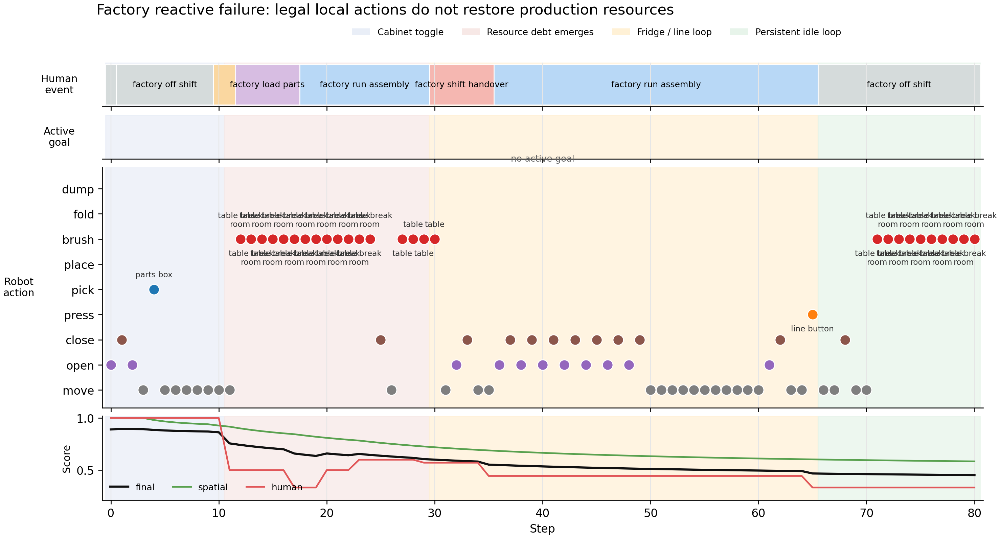
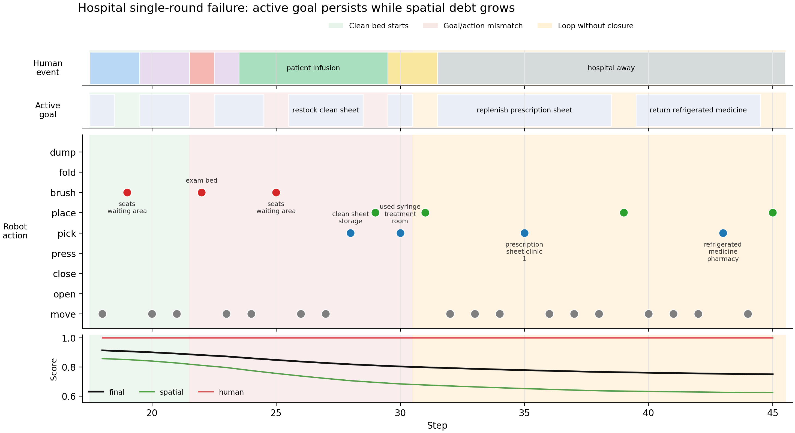

# GraphWorld

GraphWorld 是一个面向长时程具身任务规划的持续运行符号图仿真框架。这里的世界不是一次性任务快照，而是一个会被人持续使用、持续变乱、持续产生新任务的动态图：房间、物体、设备、NPC 和机器人都在同一张场景图里，状态会随人类日程、机器人动作、设备周期和环境规则不断变化。

当前核心问题：

```text
机器人能不能在无限任务流中长期维持世界，而不是只完成一条给定指令。
```

也就是说，我们关心的不是“把杯子放到桌上”这种短任务，而是：人每天会穿衣、吃饭、看病、购物、开会、生产；这些活动会消耗资源、弄脏物体、移动关键物品、打开设备、制造垃圾。机器人需要持续发现问题、选择任务、执行完整闭环，让世界分数和人的活动成功率回升。

## 快速命令

TensorBoard：

```bash
tensorboard --logdir backend/data/tensorboard --host 0.0.0.0 --port 6006
```

跑 baseline：

```bash
cd /home/jansen/GraphWorld

/home/jansen/miniconda3/envs/gra/bin/python backend/run_experiment.py \
  --scene simple_supermarket_1f \
  --steps 1600 \
  --only no_robot \
  --robots 0 \
  --humans 3 \
  --no-clean \
  --replay-scene-interval 20 \
  --metric-log-interval 20
```

跑单轮 agent：

```bash
VLLM_MODEL=qwen35-9b \
VLLM_BASE_URL=http://127.0.0.1:8000/v1 \
/home/jansen/miniconda3/envs/gra/bin/python backend/run_experiment.py \
  --scene simple_supermarket_1f \
  --steps 1600 \
  --only with_robot \
  --robots 1 \
  --humans 3 \
  --agent-model vllm-qwen3.5-9b \
  --agent-mode single_round \
  --no-clean \
  --replay-scene-interval 20 \
  --metric-log-interval 10
```

跑多轮/goal-review agent：

```bash
VLLM_MODEL=qwen35-9b \
VLLM_BASE_URL=http://127.0.0.1:8000/v1 \
/home/jansen/miniconda3/envs/gra/bin/python backend/run_experiment.py \
  --scene simple_supermarket_1f \
  --steps 1600 \
  --only with_robot \
  --robots 1 \
  --humans 3 \
  --agent-model vllm-qwen3.5-9b \
  --agent-mode goal_review \
  --no-clean \
  --replay-scene-interval 20 \
  --metric-log-interval 10
```

输出目录带方法名，避免混：

```text
model_vllm_qwen3_5_9b_single_round
model_vllm_qwen3_5_9b_goal_review
model_vllm_qwen3_5_9b_reactive
```

续跑：

```bash
# 先列出所有可续跑的中断 run
/home/jansen/miniconda3/envs/gra/bin/python backend/run_experiment.py --resume

# 选一个 run_id 或完整 run 目录继续
/home/jansen/miniconda3/envs/gra/bin/python backend/run_experiment.py \
  --resume \
  --resume-run 20260513T062846Z_0bb6e257 \
  --no-clean
```

## 当前重跑清单

NPC event effect 更新后，世界动态和 no_robot baseline 都变了。为了公平对比，旧的 agent 曲线不要和新 baseline 混用。

核心 base-scene 实验一共需要：

```text
5 scenes x (no_robot + reactive + single_round + goal_review) = 20 runs
```

其中 5 个 `no_robot` 已经重跑过。现在主要补 15 个机器人实验：

```text
5 scenes x 3 agent methods = 15 runs
```

### reactive

```bash
cd /home/jansen/GraphWorld

VLLM_MODEL=qwen35-9b VLLM_BASE_URL=http://127.0.0.1:8000/v1 /home/jansen/miniconda3/envs/gra/bin/python backend/run_experiment.py --scene simple_home_1f --steps 1600 --only with_robot --robots 1 --humans 1 --agent-model vllm-qwen3.5-9b --agent-mode reactive --no-clean --replay-scene-interval 20 --metric-log-interval 10
VLLM_MODEL=qwen35-9b VLLM_BASE_URL=http://127.0.0.1:8000/v1 /home/jansen/miniconda3/envs/gra/bin/python backend/run_experiment.py --scene simple_hospital_1f --steps 1600 --only with_robot --robots 1 --humans 3 --agent-model vllm-qwen3.5-9b --agent-mode reactive --no-clean --replay-scene-interval 20 --metric-log-interval 10
VLLM_MODEL=qwen35-9b VLLM_BASE_URL=http://127.0.0.1:8000/v1 /home/jansen/miniconda3/envs/gra/bin/python backend/run_experiment.py --scene simple_supermarket_1f --steps 1600 --only with_robot --robots 1 --humans 3 --agent-model vllm-qwen3.5-9b --agent-mode reactive --no-clean --replay-scene-interval 20 --metric-log-interval 10
VLLM_MODEL=qwen35-9b VLLM_BASE_URL=http://127.0.0.1:8000/v1 /home/jansen/miniconda3/envs/gra/bin/python backend/run_experiment.py --scene simple_office_1f --steps 1600 --only with_robot --robots 1 --humans 3 --agent-model vllm-qwen3.5-9b --agent-mode reactive --no-clean --replay-scene-interval 20 --metric-log-interval 10
VLLM_MODEL=qwen35-9b VLLM_BASE_URL=http://127.0.0.1:8000/v1 /home/jansen/miniconda3/envs/gra/bin/python backend/run_experiment.py --scene simple_factory_1f --steps 1600 --only with_robot --robots 1 --humans 3 --agent-model vllm-qwen3.5-9b --agent-mode reactive --no-clean --replay-scene-interval 20 --metric-log-interval 10
```

### single_round

```bash
cd /home/jansen/GraphWorld

VLLM_MODEL=qwen35-9b VLLM_BASE_URL=http://127.0.0.1:8000/v1 /home/jansen/miniconda3/envs/gra/bin/python backend/run_experiment.py --scene simple_home_1f --steps 1600 --only with_robot --robots 1 --humans 1 --agent-model vllm-qwen3.5-9b --agent-mode single_round --no-clean --replay-scene-interval 20 --metric-log-interval 10
VLLM_MODEL=qwen35-9b VLLM_BASE_URL=http://127.0.0.1:8000/v1 /home/jansen/miniconda3/envs/gra/bin/python backend/run_experiment.py --scene simple_hospital_1f --steps 1600 --only with_robot --robots 1 --humans 3 --agent-model vllm-qwen3.5-9b --agent-mode single_round --no-clean --replay-scene-interval 20 --metric-log-interval 10
VLLM_MODEL=qwen35-9b VLLM_BASE_URL=http://127.0.0.1:8000/v1 /home/jansen/miniconda3/envs/gra/bin/python backend/run_experiment.py --scene simple_supermarket_1f --steps 1600 --only with_robot --robots 1 --humans 3 --agent-model vllm-qwen3.5-9b --agent-mode single_round --no-clean --replay-scene-interval 20 --metric-log-interval 10
VLLM_MODEL=qwen35-9b VLLM_BASE_URL=http://127.0.0.1:8000/v1 /home/jansen/miniconda3/envs/gra/bin/python backend/run_experiment.py --scene simple_office_1f --steps 1600 --only with_robot --robots 1 --humans 3 --agent-model vllm-qwen3.5-9b --agent-mode single_round --no-clean --replay-scene-interval 20 --metric-log-interval 10
VLLM_MODEL=qwen35-9b VLLM_BASE_URL=http://127.0.0.1:8000/v1 /home/jansen/miniconda3/envs/gra/bin/python backend/run_experiment.py --scene simple_factory_1f --steps 1600 --only with_robot --robots 1 --humans 3 --agent-model vllm-qwen3.5-9b --agent-mode single_round --no-clean --replay-scene-interval 20 --metric-log-interval 10
```

### goal_review

```bash
cd /home/jansen/GraphWorld

VLLM_MODEL=qwen35-9b VLLM_BASE_URL=http://127.0.0.1:8000/v1 /home/jansen/miniconda3/envs/gra/bin/python backend/run_experiment.py --scene simple_home_1f --steps 1600 --only with_robot --robots 1 --humans 1 --agent-model vllm-qwen3.5-9b --agent-mode goal_review --no-clean --replay-scene-interval 20 --metric-log-interval 10
VLLM_MODEL=qwen35-9b VLLM_BASE_URL=http://127.0.0.1:8000/v1 /home/jansen/miniconda3/envs/gra/bin/python backend/run_experiment.py --scene simple_hospital_1f --steps 1600 --only with_robot --robots 1 --humans 3 --agent-model vllm-qwen3.5-9b --agent-mode goal_review --no-clean --replay-scene-interval 20 --metric-log-interval 10
VLLM_MODEL=qwen35-9b VLLM_BASE_URL=http://127.0.0.1:8000/v1 /home/jansen/miniconda3/envs/gra/bin/python backend/run_experiment.py --scene simple_supermarket_1f --steps 1600 --only with_robot --robots 1 --humans 3 --agent-model vllm-qwen3.5-9b --agent-mode goal_review --no-clean --replay-scene-interval 20 --metric-log-interval 10
VLLM_MODEL=qwen35-9b VLLM_BASE_URL=http://127.0.0.1:8000/v1 /home/jansen/miniconda3/envs/gra/bin/python backend/run_experiment.py --scene simple_office_1f --steps 1600 --only with_robot --robots 1 --humans 3 --agent-model vllm-qwen3.5-9b --agent-mode goal_review --no-clean --replay-scene-interval 20 --metric-log-interval 10
VLLM_MODEL=qwen35-9b VLLM_BASE_URL=http://127.0.0.1:8000/v1 /home/jansen/miniconda3/envs/gra/bin/python backend/run_experiment.py --scene simple_factory_1f --steps 1600 --only with_robot --robots 1 --humans 3 --agent-model vllm-qwen3.5-9b --agent-mode goal_review --no-clean --replay-scene-interval 20 --metric-log-interval 10
```

如果要把 graph variant 那组也同步更新，则还要补：

```text
5 scenes x 3 graph profiles x no_robot = 15 runs
5 scenes x 3 graph profiles x goal_review = 15 runs
```

但论文主图先看 base-scene 三方法对比时，优先跑上面 15 个机器人实验。

## 引擎设计

GraphWorld 的世界状态是一个随时间演化的场景图：

```text
GraphWorld_t = Nodes + Edges + States_t + WorldState_t
```

`Nodes` 表示世界中的实体：

- `room`：房间或区域，例如 kitchen、pharmacy、checkout_area。
- `fixed_object`：固定家具、容器、设备，例如 bed、washer、fridge、cabinet、checkout counter。
- `movable_object`：可移动物体，例如 clothes、cup、medicine_box、shopping cart、toolkit。
- `agent`：人类 NPC 和机器人。

每个节点统一保留这些核心字段：

```text
id, node_type, semantic_type, states, parent, interactive_actions
```

其中：

- `id` 是唯一节点名，运行时动作必须使用真实 node id。
- `semantic_type` 表示物体类别，例如 cup、cabinet、medicine_box。
- `states` 是动态状态，例如 `is_dirty`、`is_open`、`fill_level`、`is_wet`。
- `parent` 表示当前位置或容器挂载关系。
- `interactive_actions` 决定该节点能参与哪些动作。

`Edges` 分三类：

- 结构关系：房间包含、房间连通、物体初始包含。
- 控制关系：button/knob 和设备之间的 controls。
- 动态关系：`in`、`on`、`at`、`near`、`held_by`、`worn_by`。

运行时不会把所有动态边写死，而是维护：

```text
parent_of, relation_of, room_of, children_of
```

这样空间拓扑和临时位置变化可以分开处理。比如 cup 从 table 被拿到 robot 手上，只需要更新 parent/relation，不需要重写整个场景结构。

### 状态系统

当前状态空间包括：

```text
is_dirty, is_clean, is_open, is_on, is_pressed,
is_wet, is_dry, folded, scattered, misplaced_near,
fill_level, is_full, cycle_remaining, dry_remaining,
is_rotten, is_burnt, freshness, temperature,
needs_cleaning, needs_return, needs_filing, needs_inspection,
vitality, is_wilted, current_activity
```

状态可以由四类机制改变：

1. 机器人动作：例如 `brush` 清理脏桌子，`open/close` 改变容器状态，`dump` 倒垃圾。
2. NPC 事件：例如吃饭弄脏餐具，顾客拿走商品，护士换下脏床单。
3. 设备周期：例如洗衣机运行后让衣物从 dirty 变成 clean/wet。
4. 环境时间：例如晾衣架让湿衣服随时间变干，食物随时间腐烂。

### 运行时系统

主运行时在 `backend/runtime/engine/runtime.py`。每一步顺序是：

```text
1. 根据 step/time 生成 human events
2. 机器人感知局部世界，得到 observation
3. 枚举合法 robot action candidates
4. agent 选择动作
5. RobotActionSystem 执行动作
6. HumanEventSystem 执行 NPC 事件
7. EnvironmentSystem 推进设备、干燥、腐烂、刷新等过程
8. 计算 metrics，写 replay 和 TensorBoard
```

几个关键模块：

- `runtime.py`：调度 robot、human、environment 三套系统。
- `validator.py`：判断动作是否合法，例如关闭容器不能取放，容量满不能继续放。
- `transition_rules.py`：定义动作造成的状态转移。
- `npc_library.py`：定义 NPC、日程、事件前提和事件效果。
- `task_library.py`：定义机器人可复用技能闭环。
- `run_experiment.py`：组织实验、记录 replay、metrics、TensorBoard。

### 动作空间

当前机器人动作：

```text
move, pick, place, press, open, close, brush, fold, dump
```

动作不是任意执行的。每一步先由引擎枚举合法候选，再交给 agent 选择。这样模型不会直接输出非法动作，而是在受限动作空间里做语义决策。

重要约束：

- `pick/place` 受容器开关、容量、可达性限制。
- openable 容器关闭时，不能直接取放内部物体。
- 布类物体不能靠 `brush` 洗干净，必须走 washer -> drying_rack -> fold -> wardrobe。
- 有液体的 cup 要到 sink 执行 `dump`。
- trash_bin 只能装合适垃圾，满了要到 garbage_station 执行 `dump`。
- 冷柜、药冰箱、柜子等如果没关，会影响后续人类事件。

### NPC 事件系统

人类活动由 `EventSpec` 表示：

```text
EventSpec = preconditions + effects_on_success + effects_on_failure
```

NPC 不是随机扰动源，而是由角色、日程和价值驱动事件组成：

```text
NPC = role + schedule
schedule = 按时间排列的 EventSpec
EventSpec = preconditions + effects + value_drivers + activity_pattern
```

`role` 决定 NPC 是 resident、patient、doctor、customer、cashier、office_worker 还是 factory_worker。`schedule` 决定一天中什么时候做什么。`value_drivers` 解释这个活动为什么存在，而 `effects` 解释这个活动如何改变世界。

当前使用五类 value drivers：

| value driver             | 含义             | 例子                                     |
| ------------------------ | ---------------- | ---------------------------------------- |
| `bodily_need`          | 基础生活需求     | 吃饭、睡觉、洗漱、穿衣、购物取生活物资   |
| `health_safety`        | 健康与安全       | 看病、用药、输液、安全装备、质检、维修   |
| `role_duty`            | 职业/角色职责    | 医生看诊、护士巡房、收银员结账、工人生产 |
| `social_coordination`  | 协作与交接       | 开会、交接班、访客帮助                   |
| `creative_improvement` | 创造、学习、改进 | 写报告、审阅、整理知识、改进流程         |

因此，人类事件不是为了给机器人硬造任务，而是先定义人的活动逻辑：人为了生活、健康、职责、协作和改进而行动；这些行动自然会消耗资源、移动物体、弄脏环境、打开设备、制造垃圾。机器人任务从这些副作用中产生。

例如一个事件可以表达：

- 顾客必须先有购物车，才能购物。
- 病人必须拿到药，才能离院。
- 工人必须有安全装备，才能上岗。
- 质检员必须有待检成品和记录表，才能完成质检。

事件成功会改变图状态，例如移动物体、弄脏表面、打开设备、消耗资源。事件失败会进入 replay 和 human_event_score，表示机器人没有维护好人的活动条件。

### 评分器

评分由三部分组成：

```text
final_score = 0.45 * state_score
            + 0.35 * spatial_score
            + 0.20 * human_event_score
```

`state_score` 衡量状态健康程度，例如是否脏、是否开着、是否湿、垃圾桶是否满、设备是否异常。它比较当前状态矩阵和初始好状态矩阵：

```text
state_distance_t = #different_comparable_states(S_t, S_0)
                 / #comparable_states(S_t, S_0)

instant_state_score_t = 1 - state_distance_t

state_score_t = mean(instant_state_score_0 ... instant_state_score_t)
```

`spatial_score` 衡量物体关系是否合理，例如药是否在药房、报告是否归档、购物车是否回入口、衣服是否在衣柜。它比较可移动物体的当前 parent/relation 和初始好位置：

```text
relation_distance_t = #misplaced_movable_objects(R_t, R_0)
                    / #movable_objects_in_baseline

instant_spatial_score_t = 1 - relation_distance_t

spatial_score_t = mean(instant_spatial_score_0 ... instant_spatial_score_t)
```

`human_event_score` 衡量 NPC 日程事件是否成功，例如顾客能否购物、病人能否取药、工人能否上岗。它是截至当前时刻已经结束的人类事件成功率：

```text
human_event_score_t = #successful_finished_human_events(0..t)
                    / #finished_human_events(0..t)
```

这三个分数都是长时程累计指标。坏状态持续越久，历史债越重；机器人后面修好了，instant score 会回升，累计分也会慢慢回升。

## 场景配置

集中分析已有五个场景。

| 场景        | 房间 | 固定物体 | 可移动物体 | NPC | NPC 角色                                              | 技能库                                                                                                                                                                                                                                             |
| ----------- | ---: | -------: | ---------: | --: | ----------------------------------------------------- | -------------------------------------------------------------------------------------------------------------------------------------------------------------------------------------------------------------------------------------------------- |
| home        |    7 |       51 |         17 |   1 | resident                                              | 3 种：`laundry_clothes`, `dispose_food`, `empty_cup`                                                                                                                                                                                         |
| hospital    |   10 |       48 |         11 |   3 | patient, nurse, doctor                                | 9 种：`replenish_prescription_sheet`, `replenish_medicine_box`, `return_refrigerated_medicine`, `clean_medical_waste`, `collect_dirty_linen`, `restock_clean_sheet`, `return_wheelchair`, `clean_waiting_area`, `clean_exam_bed` |
| supermarket |    7 |       16 |         11 |   3 | customer, cashier, stocker                            | 5 种：`return_cart`, `restock_produce`, `restock_cold_food`, `close_cold_case`, `maintain_checkout_and_trash`                                                                                                                            |
| office      |    7 |       24 |          3 |   3 | office_worker, manager, visitor                       | 4 种：`file_report`, `reset_meeting_room`, `return_cups`, `reset_workstations`                                                                                                                                                             |
| factory     |    8 |       19 |         10 |   3 | factory_worker, quality_inspector, maintenance_worker | 6 种：`return_safety_equipment`, `restock_parts`, `clear_finished_goods`, `file_quality_record`, `return_toolkit`, `reset_handover_area`                                                                                               |

### Home

NPC 事件：

```text
sleeping -> waking_up -> getting_dressed -> washing_up_morning
-> breakfast -> leaving_home -> away_at_work -> returning_home
-> waiting_for_dinner -> eating -> washing_up_night
```

主要闭环：

- 衣物：干净衣服被穿走，夜间变成脏衣服；机器人要洗衣、晾干、折叠、收回衣柜。
- 餐具：吃饭制造脏杯子、脏盘子、脏碗；机器人要清洁并归位。
- 食物：食物被消费后产生垃圾/坏食物；机器人要放入垃圾桶并倒掉垃圾。
- 空间秩序：鞋、餐具、衣服、垃圾桶等被移动后，需要回到合理位置。

### Hospital

NPC 事件：

```text
patient: hospital_away, patient_register, patient_wait, patient_consult,
         patient_take_medicine, patient_infusion, patient_leave

nurse: hospital_off_shift, nurse_prepare, nurse_round,
       nurse_deliver_medicine, nurse_change_bed_sheet,
       nurse_clean_bed, nurse_restock_supplies

doctor: hospital_off_shift, doctor_prepare, doctor_call_patient,
        doctor_examine_patient, doctor_prescribe
```

主要闭环：

- 处方单：医生开处方后，处方单需要回到诊室。
- 药品：药盒和冷藏药会被病人带走，离院后在补给区刷新，机器人要送回药房/药冰箱。
- 输液与治疗：治疗床、检查床、候诊区会变脏，需要清理。
- 床单：护士换床单后产生脏床单，需要回收；干净床单需要补回柜子。
- 医疗垃圾：医疗垃圾必须进入医疗垃圾桶，不能混进普通垃圾。
- 轮椅：病人使用后需要归位。

### Supermarket

NPC 事件：

```text
customer: store_away, customer_enter, customer_take_cart,
          customer_shop_produce, customer_shop_cold,
          customer_checkout, customer_leave_store

cashier: store_off_shift, cashier_prepare, cashier_scan_items
stocker: store_off_shift, stocker_inspect
```

主要闭环：

- 购物车：顾客拿车，结账后车到回收点；机器人要送回入口。
- 货架补货：水果、冷藏食品被顾客拿走，结账后进入到货区；机器人要补回货架/冷柜。
- 冷链：冷柜被打开后必须关上，否则后续冷藏购物事件失败。
- 收银区：收银台会变脏，显示屏需要保持可用，机器人要清理和维护。
- 垃圾：结账产生垃圾，垃圾桶满了要处理。

### Office

NPC 事件：

```text
office_worker: office_away, office_worker_arrive, office_focus_work,
               office_team_meeting, office_visitor_help, office_leave

manager: office_off_shift, office_manager_review, office_team_meeting
visitor: office_away, office_visitor_help
```

主要闭环：

- 报告：员工从文件柜拿报告，写完放桌上，会议后留在会议桌；机器人要归档回文件柜。
- 会议室：会议会弄脏桌子、打开显示器、留下杯子；机器人要清理并复位。
- 茶水间：访客和会议使用杯子，杯子需要清洁并回到茶水间。
- 办公桌：工作和管理审阅会弄脏桌面、打开电脑，机器人要清理和关停。

### Factory

NPC 事件：

```text
factory_worker: factory_off_shift, factory_worker_prepare,
                factory_load_parts, factory_run_assembly,
                factory_shift_handover

quality_inspector: factory_off_shift, factory_quality_check,
                   factory_shift_handover

maintenance_worker: factory_off_shift, factory_maintenance_check
```

主要闭环：

- 安全装备：工人上岗前要从入口柜取安全装备；机器人要回收到柜子。
- 物料：零件箱从仓库货架到产线；机器人要补回货架，保证下一轮生产。
- 成品：产线产生成品，质检后状态变化；机器人要清理工位和恢复空间。
- 质检记录：质检员使用记录表，机器人要归档回控制室柜子。
- 维修工具：维修员取工具维护机器，机器人要把工具包放回柜子。
- 交接：交接会打开控制室显示器、弄脏休息区桌面，需要机器人复位。

## 实验

当前实验目标是把 GraphWorld 当作长期机器人维护能力的诊断环境。我们不只看 agent 是否能输出合法动作，而是看它能不能在持续人类活动、环境时间和设备状态变化中长期恢复世界秩序。

### 实验设置

实验分两层。

第一层是 base scene，对比不同机器人方法：

| 组别         | 含义                                                                                                                     |
| ------------ | ------------------------------------------------------------------------------------------------------------------------ |
| no_robot     | 只有 NPC 和环境推进，没有机器人维护                                                                                      |
| reactive     | 最弱 LLM 机器人：不给 active_goal、skills、initial_context、high_level_options，只给简单角色、最近分数、可见图和合法动作 |
| single_round | 一次 LLM 调用：给 active_goal、技能、候选动作，让模型直接选 high_level_task 和 action                                    |
| goal_review  | 两次 LLM 调用：先判断继续/切换/完成 active_goal，再选择低层 action                                                       |

base scene 矩阵：

```text
5 scenes x (no_robot + 3 agent methods) = 20 runs
```

第二层是 scene graph 难度变体，用来回答一个更关键的问题：**agent 是真的学会了长期维护，还是只在固定图上被我们提示词喂得太舒服。**

每个 base scene 生成三个静态 scene graph 变体：

| profile              | 拓扑                 | 任务物体压力           | 目的                           |
| -------------------- | -------------------- | ---------------------- | ------------------------------ |
| `compact_cleaning` | 房间和关键物体更集中 | 清洁类债务为主         | 低难度，测试基本清洁维护       |
| `normal_logistics` | 保留原始拓扑         | 搬运、归位、补给为主   | 中难度，测试物流闭环           |
| `spread_device`    | 关键房间和设备拉远   | 设备链和跨房间依赖为主 | 高难度，测试长链任务和空间探索 |

variant 矩阵：

```text
5 scenes x 3 graph profiles = 15 scene variants
```

命名方式：

```text
simple_home_1f__compact_cleaning
simple_home_1f__normal_logistics
simple_home_1f__spread_device
...
```

所有实验默认运行 1600 step。home 使用 1 个 human，其余场景使用 3 个 human。

### 为什么要做三种 graph profile

如果只在一个固定场景图上测试，agent 分数高可能有三种解释：

1. agent 真的能长期维护世界。
2. 场景太简单，机器人只要做几个固定闭环就够。
3. prompt 和规则给得太多，模型只是在结构化候选里做很小的选择。

所以新增 graph profile 不是为了继续堆场景类型，而是为了在同一类场景内部改变难度：

- `compact_cleaning`：任务集中，空间成本低，主要看能不能快速清理。
- `normal_logistics`：物品在典型位置流转，主要看能不能完成归位和补给。
- `spread_device`：房间更分散，任务依赖设备链，主要看 agent 是否能坚持长目标。

预期 no_robot 的下降趋势是：

```text
compact_cleaning 掉分最慢
normal_logistics 居中
spread_device 掉分最快
```

这个趋势已经用 15 个 no_robot 1600-step run 检查过，排序成立。后续要补的是 15 个 with_robot `goal_review`，看机器人是否还能在更难 graph 上拉开和 no_robot 的差距。

### No-robot 难度检查

`final`：最后一步长期累计分。

`AUC`：整条曲线的平均分，近似表示长期维持水平。

| 场景        | compact final/AUC | normal final/AUC | spread final/AUC |
| ----------- | ----------------: | ---------------: | ---------------: |
| home        |   0.7825 / 0.8138 |  0.7803 / 0.8120 |  0.7799 / 0.8117 |
| hospital    |   0.6776 / 0.7002 |  0.6748 / 0.6976 |  0.6703 / 0.6933 |
| supermarket |   0.7793 / 0.8013 |  0.7664 / 0.7890 |  0.7635 / 0.7862 |
| office      |   0.6378 / 0.6521 |  0.6287 / 0.6436 |  0.6270 / 0.6420 |
| factory     |   0.6567 / 0.6683 |  0.6502 / 0.6620 |  0.6464 / 0.6583 |

- 五个场景都满足 `compact >= normal >= spread`。
- home 的差距很小，说明 home 的长期压力主要来自日程周期，不太受拓扑变体影响。
- supermarket、office、factory 的差距更明显，说明这些场景更适合用来区分机器人维护能力。

### 当前要跑的核心实验

下一批重点不是再扩场景，而是把 15 个 graph variants 的 with_robot 跑完：

```text
5 scenes x 3 graph profiles x goal_review = 15 runs
```

这批实验验证三个问题：

1. agent 在换图后是否仍然能超过 no_robot。
2. `spread_device` 是否明显比 `compact_cleaning` 更难维护。
3. agent 的收益主要来自 state、spatial 还是 human_event。

| Scene | Profile          | No Robot Final | Robot Final | ΔFinal | No Robot AUC | Robot AUC | ΔAUC |
| ----- | ---------------- | -------------: | ----------: | ------: | -----------: | --------: | ----: |
| home  | compact_cleaning |                |             |         |              |           |       |
| home  | normal_logistics |                |             |         |              |           |       |
| home  | spread_device    |                |             |         |              |           |       |

### 主图


这张图用于 base scene 方法对比。它按列展示五个场景，按行展示四个指标：

- `final_score`：综合长期表现。
- `state_score`：清洁、开闭、湿度、腐烂、设备状态等状态健康度。
- `spatial_score`：可移动物体是否回到合理位置。
- `human_event_score`：NPC 日程事件是否成功。

颜色含义：

- 灰色虚线：`no_robot`
- 红色：`reactive`
- 黄色：`single_round`
- 蓝色：`goal_review`

### Base scene 最终结果

这张表不是只报分数，主要想说明三件事：

1. `reactive` 是一个很弱的下界：只给局部观察和合法动作，模型通常不会自动形成长期维护策略。
2. `single_round / goal_review` 的提升主要来自 `spatial_score`，说明长期维护的核心是把关键物体放回能支持下一轮人类活动的位置。
3. 不同场景暴露不同短板：hospital 更考验流程闭环，factory 更考验从局部动作里跳出来做搬运和归位。

摘要如下：

| 场景        | 最好方法         | 相比 no_robot 的 Final 变化 | 最主要收益      | 说明                                                             |
| ----------- | ---------------- | --------------------------: | --------------- | ---------------------------------------------------------------- |
| home        | `single_round` |                     +0.1116 | Spatial + Human | 家庭任务比较规则，单轮目标已经能维护洗衣、餐具和归位             |
| hospital    | `goal_review`  |                     +0.1700 | Spatial + Human | 医院流程链更长，goal review 能更好坚持补药、床单、医疗废物等闭环 |
| supermarket | `single_round` |                     +0.1783 | Spatial + Human | 购物车、冷柜、货架和收银区被维护后，人类事件明显恢复             |
| office      | `single_round` |                     +0.3260 | Spatial         | 文件、杯子、会议室、工位归位带来最大收益                         |
| factory     | `single_round` |                     +0.2414 | Spatial         | 工厂主要靠安全装备、零件箱、工具、质检记录的物流恢复             |

原始分数如下。颜色含义：

- `<span style="background-color:#d9ead3">`绿色：该场景 Final 最高的方法。
- `<span style="background-color:#f4cccc">`红色：低于 no_robot，说明虽然有机器人，但动作没有转化成有效维护。

| 场景                                                   | 方法                                                    |                                             Final |                                             State |                                           Spatial |                                             Human |
| ------------------------------------------------------ | ------------------------------------------------------- | ------------------------------------------------: | ------------------------------------------------: | ------------------------------------------------: | ------------------------------------------------: |
| home                                                   | no_robot                                                |                                            0.7802 |                                            0.8888 |                                            0.6049 |                                            0.8425 |
| `<span style="background-color:#f4cccc">`home        | `<span style="background-color:#f4cccc">`reactive     | `<span style="background-color:#f4cccc">`0.7553 | `<span style="background-color:#f4cccc">`0.8341 | `<span style="background-color:#f4cccc">`0.6049 | `<span style="background-color:#f4cccc">`0.8413 |
| `<span style="background-color:#d9ead3">`home        | `<span style="background-color:#d9ead3">`single_round | `<span style="background-color:#d9ead3">`0.8918 | `<span style="background-color:#d9ead3">`0.8926 | `<span style="background-color:#d9ead3">`0.8743 | `<span style="background-color:#d9ead3">`0.9206 |
| home                                                   | goal_review                                             |                                            0.8536 |                                            0.8652 |                                            0.8004 |                                            0.9206 |
| hospital                                               | no_robot                                                |                                            0.6773 |                                            0.9074 |                                            0.2816 |                                            0.8519 |
| `<span style="background-color:#f4cccc">`hospital    | `<span style="background-color:#f4cccc">`reactive     | `<span style="background-color:#f4cccc">`0.6522 | `<span style="background-color:#f4cccc">`0.8704 | `<span style="background-color:#f4cccc">`0.2808 | `<span style="background-color:#f4cccc">`0.8111 |
| `<span style="background-color:#f4cccc">`hospital    | `<span style="background-color:#f4cccc">`single_round | `<span style="background-color:#f4cccc">`0.6698 | `<span style="background-color:#f4cccc">`0.9073 | `<span style="background-color:#f4cccc">`0.2816 | `<span style="background-color:#f4cccc">`0.8148 |
| `<span style="background-color:#d9ead3">`hospital    | `<span style="background-color:#d9ead3">`goal_review  | `<span style="background-color:#d9ead3">`0.8473 | `<span style="background-color:#d9ead3">`0.9253 | `<span style="background-color:#d9ead3">`0.7106 | `<span style="background-color:#d9ead3">`0.9111 |
| supermarket                                            | no_robot                                                |                                            0.7693 |                                            0.8919 |                                            0.7297 |                                            0.5629 |
| supermarket                                            | reactive                                                |                                            0.7792 |                                            0.9463 |                                            0.7371 |                                            0.4768 |
| `<span style="background-color:#d9ead3">`supermarket | `<span style="background-color:#d9ead3">`single_round | `<span style="background-color:#d9ead3">`0.9476 | `<span style="background-color:#d9ead3">`0.9059 | `<span style="background-color:#d9ead3">`0.9751 | `<span style="background-color:#d9ead3">`0.9934 |
| supermarket                                            | goal_review                                             |                                            0.9289 |                                            0.9027 |                                            0.9485 |                                            0.9536 |
| office                                                 | no_robot                                                |                                            0.6261 |                                            0.8993 |                                            0.3414 |                                            0.5096 |
| office                                                 | reactive                                                |                                            0.6580 |                                            0.9737 |                                            0.3368 |                                            0.5096 |
| `<span style="background-color:#d9ead3">`office      | `<span style="background-color:#d9ead3">`single_round | `<span style="background-color:#d9ead3">`0.9521 | `<span style="background-color:#d9ead3">`0.9807 | `<span style="background-color:#d9ead3">`0.9681 | `<span style="background-color:#d9ead3">`0.8599 |
| office                                                 | goal_review                                             |                                            0.8918 |                                            0.9563 |                                            0.8854 |                                            0.7580 |
| factory                                                | no_robot                                                |                                            0.6449 |                                            0.9274 |                                            0.5053 |                                            0.2537 |
| `<span style="background-color:#f4cccc">`factory     | `<span style="background-color:#f4cccc">`reactive     | `<span style="background-color:#f4cccc">`0.6144 | `<span style="background-color:#f4cccc">`0.9368 | `<span style="background-color:#f4cccc">`0.4061 | `<span style="background-color:#f4cccc">`0.2537 |
| `<span style="background-color:#d9ead3">`factory     | `<span style="background-color:#d9ead3">`single_round | `<span style="background-color:#d9ead3">`0.8863 | `<span style="background-color:#d9ead3">`0.9475 | `<span style="background-color:#d9ead3">`0.9858 | `<span style="background-color:#d9ead3">`0.5746 |
| factory                                                | goal_review                                             |                                            0.8560 |                                            0.9433 |                                            0.9556 |                                            0.4851 |

### 主要观察

1. `reactive` 在多数场景中不能稳定超过 `no_robot`。这说明只给局部观察和合法动作，并不足以让 LLM 自发学会长期维护。
2. `single_round` 和 `goal_review` 的主要收益来自 `spatial_score`，尤其是 home、supermarket、office、factory。长期维护的关键不是多做动作，而是把关键物体放回对后续人类事件有用的位置。
3. hospital 是强流程依赖场景。`goal_review` 明显优于 `single_round`，说明医院补药、处方、床单、医疗废物等任务需要更强的长期目标保持。
4. factory 暴露了 reactive 的典型失败：它大量执行合法但无效的局部动作，例如围绕按钮、产线、冰箱、工作间反复 `move/open/close/press`，但几乎不 `pick/place`。最新 factory reactive 统计为 `move=925, press=344, open=165, close=164, pick=1, place=0`，所以空间债无法恢复，最终甚至低于 no_robot。
5. 这些结果说明 GraphWorld 的价值不只是证明某个 agent 更强，而是暴露不同 agent 在长期机器人维护任务中的弱点：局部 affordance 偏置、目标保持不足、闭环完成不足、时间窗口不敏感。

### Failure case 分析

当前重点 failure case 图包括：





重画命令：

```bash
/home/jansen/miniconda3/envs/gra/bin/python paper/analysis/plot_focused_figures.py
```

## 分数为什么涨落

分数下降不是单一原因，而是三条线共同作用：

```text
final_score = 0.45 * state_score
            + 0.35 * spatial_score
            + 0.20 * human_event_score
```

`state_score` 下降通常来自状态债：

- 桌面、床、候诊椅、检查床变脏。
- 冷柜、柜子、门、电脑、显示器被打开后没关。
- 垃圾桶 fill_level 上升。
- 衣服湿、脏、未折叠。
- 机器进入 needs_maintenance。

`spatial_score` 下降通常来自位置债：

- 人把物体从初始位置拿走，比如衣服、药盒、报告、工具、购物车。
- 物体进入中间节点，比如到货区、回收点、会议桌、产线、病人身上。
- 机器人拿起物体但没完成放回。

`human_event_score` 下降来自服务失败：

- 人需要的东西不在正确位置，例如干净衣服不在衣柜、药不在药房、购物车不在入口、报告不在桌上。
- 设备状态不对，例如冷柜没关、收银屏幕没开、治疗床没清理。
- 上一个闭环没完成，导致下一次人类活动无法继续。

分数回升一般来自机器人完成闭环：

- 清洁动作让 dirty/needs_cleaning 消失，state_score 回升。
- pick/place 把关键物体放回初始或任务需要的位置，spatial_score 回升。
- 倒垃圾、补货、归档、关冷柜、补药、回收床单这些动作，让下一轮 NPC 事件重新可成功，human_event_score 回升。

所以涨落不是噪声，而是“人制造任务 -> 世界变差 -> 机器人维护 -> 世界恢复”的周期。真正要深入分析的，是机器人在哪些时间点完成了哪些闭环，以及这些闭环之后哪一项分数回升。

## Agent 方法

当前主方法不是纯反应式，也不是完整符号规划器，而是：

```text
规则枚举问题和合法动作
+ active_goal 维持长期任务
+ skill_library 提供常见闭环流程
+ LLM 做语义选择
+ ranker/engine 做约束和纠偏
```

### 输入怎么组装

每一步给模型的主要字段：

```json
{
  "task": "Restore the scene toward the initial good arrangement...",
  "robot_state": {
    "step": 0,
    "room_or_parent": "living_room",
    "holding": "",
    "visible_rooms": ["living_room"]
  },
  "rules": [
    "Prefer actions that directly fix bad states...",
    "Use pick before place...",
    "Dirty clothes must be washed in washer..."
  ],
  "active_goal": {},
  "skills": [],
  "initial_context": {
    "visible_rooms": [],
    "target_rooms": [],
    "room_edges": [],
    "initial_locations_for_current_issues": [],
    "relevant_interaction_targets": [],
    "current_spatial_issues": []
  },
  "high_level_options": [],
  "visible_nodes": [],
  "candidates": [],
  "response_format": {
    "high_level_task": "skill_name or restore_initial_position object -> initial_parent",
    "action_index": 0
  }
}
```

字段含义：

- `robot_state`：机器人当前在哪里、拿着什么、看见哪些房间。
- `rules`：硬规则和常识约束，告诉模型什么捷径不允许。
- `active_goal`：当前长期目标，例如“把某件衣服洗净晾干叠好收回衣柜”。
- `skills`：只放当前相关技能，不把完整手册塞进去。
- `initial_context`：初始位置、房间连接、目标房间、当前空间错误和交互目标。
- `high_level_options`：模型只能从这里选大目标，不能随便编 goal。
- `visible_nodes`：当前可见节点和状态。
- `candidates`：引擎校验过的合法动作，每个动作有 `action_index`。

### Reactive baseline

Reactive baseline 是最弱机器人方法，只调用一次 LLM，但不给长期任务结构：

```text
输入：简单角色提示 + 最近分数 + robot_state + visible_nodes + candidates
输出：action_index
```

它不知道 initial good arrangement，不知道 active_goal，不看 skill，不看 high_level_options。这个 baseline 用来回答：如果只靠局部可见图和分数反馈，模型能不能自己长期维护世界。

### 单轮方法

单轮只调用一次 LLM：

```text
输入 active_goal + skills + candidates
输出 high_level_task + action_index
```

优点是便宜、直接。问题是模型每一步容易被局部候选吸走，比如看到 close/open/brush 就去做短动作，而不是坚持完成长流程。

### 多轮/goal-review 方法

多轮每步调用两次 LLM：

```text
1. goal review:
   在 active_goal 和 high_level_options 里选择 continue / switch / finish / drop

2. action choice:
   在当前 goal 下选择一个 legal action_index
```

这样做的动机是把“我要不要继续当前大目标”和“当前执行哪一步动作”拆开。它更接近人做事：先判断任务是否完成或卡住，再决定下一步。

当前限制也很清楚：如果每一步都问 goal review，模型可能过度切换目标。更合理的版本是只在这些情况下 review：

- active_goal 已经完成。
- 连续多步没有推进。
- 当前目标对象不可见或不可达。
- 出现高优先级短任务，例如垃圾桶满、冷柜开着、关键设备异常。

### 技能库

技能库在 `backend/core/assets/task_library.py`，现在包含家庭和医院的完整闭环：

```text
dispose_food
empty_cup
laundry_clothes
replenish_prescription_sheet
replenish_medicine_box
return_refrigerated_medicine
clean_medical_waste
collect_dirty_linen
restock_clean_sheet
return_wheelchair
clean_waiting_area
clean_exam_bed
```

技能不是替代 LLM 的固定脚本，而是告诉模型“这类任务应该帮人帮到底”。例如 laundry 不是 brush 一下衣服，而是：

```text
放进洗衣机 -> 启动洗涤 -> 放到晾衣架 -> 等干 -> fold -> 收进衣柜
```

## 运行机制

每一步：

1. 根据世界时间生成 NPC 事件。
2. 机器人局部观察，得到可见节点和合法候选动作。
3. 系统枚举可维护的问题，更新或保留 active_goal。
4. LLM 选择目标和动作。
5. `RobotActionSystem` 执行动作。
6. `HumanEventSystem` 执行人类活动，并记录成功/失败。
7. `EnvironmentSystem` 推进设备周期、晾干、腐烂、垃圾刷新等环境过程。
8. 写出 replay、metrics、TensorBoard。

动作空间：

```text
move, pick, place, press, open, close, brush, fold, dump
```

重要约束：

- 关闭的容器不能直接取放。
- 布类不能 brush 洗干净，必须走洗衣流程。
- wet cloth 要上 drying_rack，随时间变干。
- 垃圾桶有容量，满了要去 garbage_station dump。
- 冷柜、药冰箱等 openable 容器会影响后续人类事件。
- movable object 必须用真实 node id，不能用 semantic_type 当目标。

## 当前结论

1. 场景已经够用。现在重点不应继续堆场景，而是分析五个场景里分数涨落和机器人行为的因果关系。
2. baseline 普遍呈周期性下降：NPC 活动不断制造状态债和位置债。
3. robot 能让分数回升，但回升来自具体闭环，不是玄学：清理、归位、补货、关门、倒垃圾、洗衣、补药。
4. 之前 office/factory/supermarket 过于简单或贴线，主要是场景逻辑问题：前置条件太松，柜子 affordance 不完整。现在已经收紧。
5. 单轮和多轮都值得保留。单轮是便宜基线，多轮是方法主张，但多轮需要控制 review 频率，避免目标过度切换。
