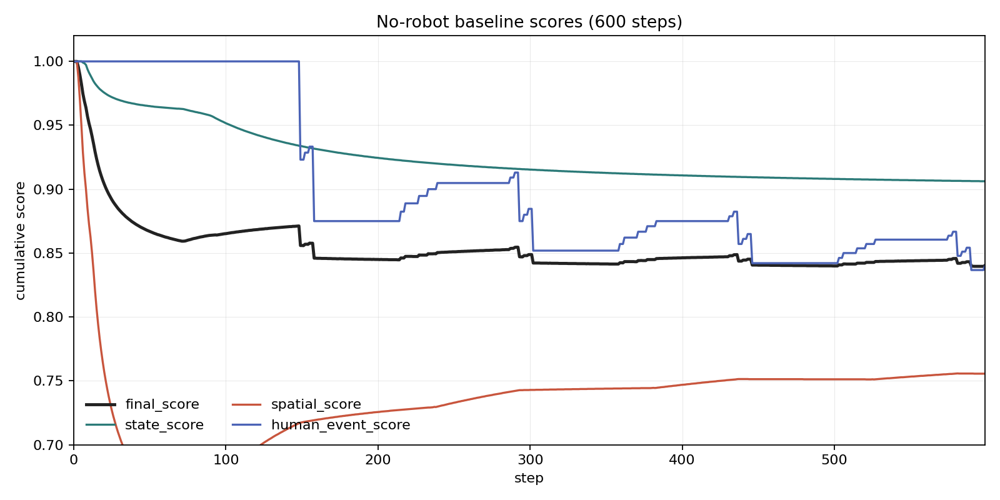
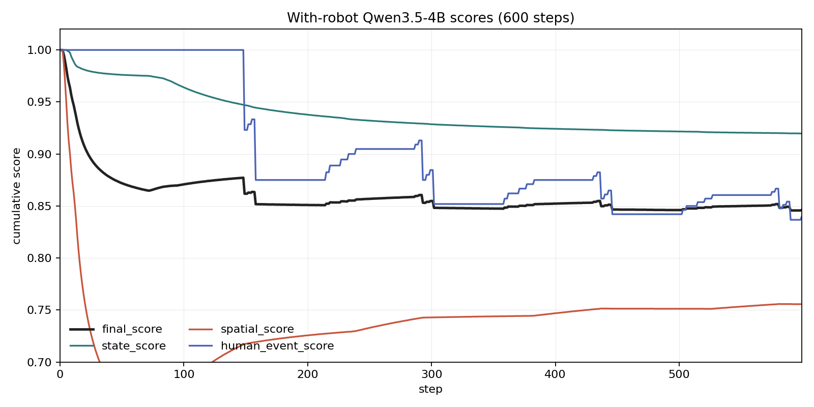

tensorboard --logdir backend/data/tensorboard --host 0.0.0.0 --port 6006


# GraphWorld 内部同步文档

本文档用于同步当前 GraphWorld 的实现状态、运行机制、评分机制，以及后续讨论的需求清单。

## 核心定义

GraphWorld 的核心定义按四类组织:

```text
Nodes
Edges
Actions
States
```
### Nodes

当前世界用 Scene Graph 表示:

```text
Graph = Nodes + Edges + world_state
```

节点包含:

```text
room
furniture
movable_object
device
human
robot
```

Node 是世界里的实体。当前主要包括:

```text
room
    房间或空间区域，例如 bedroom / bathroom / kitchen / living_room

furniture
    固定家具或容器，例如 bed / wardrobe / sink / coffee_table / shoe_rack

movable_object
    可移动物体，例如 clothes / shoes / cup / bowl / toothbrush

device
    可交互设备，例如 washer / dishwasher / microwave / light / door

human
    人类节点，当前用于模拟 resident 的日程事件

robot
    机器人节点，用于执行动作和感知
```

Node 上的关键字段:

```text
id
node_type 
semantic_type
states
parent
child
interactive_actions
```

其中:

```text
node_type
    决定节点在图里的大类

semantic_type
    决定节点的语义类别，例如 clothes / shoes / cup / food

states
    当前状态字典，例如 is_dirty / is_open / folded / fill_level

parent / child
    当前层级关系，用于快速表达物体挂在哪个父节点下
```

### Edges

Edges 用于描述节点之间的关系，尤其是空间关系和父子关系。

定义文件:

```text
backend/core/edges.py
```

当前主要关系:

```text
parent / child
source_id / target_id / relation_type
```

relation:

```text
in
on
near
at
held_by
worn_by
connected_to
controls
part_of
```


当前 runtime 会维护:

```text
parent_of
relation_of
room_of
children_of
```

这些索引用于动作合法性校验、移动节点、感知和矩阵评分。

### Actions

Action 表示机器人可以执行的动作。

定义文件:

```text
backend/core/actions.py
```

当前动作空间主要包括:

```text
move
pick
place
open
close
press
brush
fold
```

我们把技能定义为:

```text
技能 = 动作 + 物体
```

例如:

```text
brush + cup
pick + clothes
place + shoes
press + washer_button
```

技能需要有:

```text
前置条件
后置效果
合法性校验
状态/关系更新
```

### States

State 是节点上的状态字段，用于表达当前世界的好坏、设备状态、物体状态等。

定义文件:

```text
backend/core/states.py
```

当前状态空间包括18种:

```text
is_dirty
is_open
is_on
is_wet
folded
fill_level
cycle_remaining
is_full
is_rotten
is_cooked
is_frozen
is_burnt
is_broken
is_blocked
is_pressed
is_wilted
temperature
vitality
```

状态进入状态矩阵 `S_t`的列维度，用于计算状态分。

状态扩展必须满足:

```text
可枚举
可比较
可被动作改变
可被环境时间流逝改变
可被人类事件扰动
```

## 库定义

当前 assets 库只按场景资产组织，主要分为三类:

```text
物体库
房间库
NPC库
```

`actions / states / edges` 不放在库定义里重复说明，它们分别属于前面的核心定义章节。

### 物体库

```text
1. 定义物体模板
2. 定义物体默认 states
3. 定义物体支持哪些 interactive_actions
4. 定义物体能力 capabilities
5. 根据模板构造 object node
```

物体库里有一层抽象 `Capability`:

```python
@dataclass(frozen=True)
class Capability:
    name: str
    states: Dict[str, Any] = field(default_factory=dict)
    actions: tuple[str, ...] = ()
    properties: Dict[str, Any] = field(default_factory=dict)
```

Capability 表示一种物体能力，自动给物体补充:

```text
1. 默认状态 states
2. 支持动作 actions
3. 结构属性 properties
```

当前capability:

```text
PICKABLE
    actions = pick / place

CLEANABLE
    states = is_dirty: False
    actions = brush

SWITCHABLE
    states = is_on: False
    actions = press

OPENABLE
    states = is_open: False
    actions = open / close

FILLABLE
    states = fill_level: 0.0, is_full: False

PERISHABLE
    states = is_rotten: False

PLANT_LIFE
    states = is_wilted: False, is_wet: True, vitality: 1.0

STRUCTURAL_DOOR
    states = is_open: False
    actions = open / close
    properties = door_kind / blocks_visibility / blocks_navigation

CONTAINMENT_BLOCKER
    properties = blocks_containment

START_REQUIRES_CLOSED
    properties = requires_closed_to_start
```

`ObjectTemplate` 初始化时会合并 capability:

```text
default_states = capabilities.states + template.default_states
interactive_actions = capabilities.actions + template.interactive_actions
structural properties = capabilities.properties + explicit properties
```

物体是通过 capability 组合出来的

例子:

```python
"door": ObjectTemplate(
        "door",
        "door",
        "门",
        NodeType.CONTROL_OBJECT,
        {"is_dirty": False},
        ["move"],
        "wall",
        **commons_image("door", "Door, 120 rue du Bac, Paris 10 December 2016.jpg", "CC BY 2.0"),
        capabilities=(STRUCTURAL_DOOR,),
    ),
    "button": ObjectTemplate(
        "button",
        "button",
        "按钮",
        NodeType.CONTROL_OBJECT,
        {"is_pressed": False},
        ["move"],
        "wall",
        **commons_image("button", "SparkFun push-button-33mm---pink 16094491018 o.jpg", "CC BY 2.0"),
        capabilities=(SWITCHABLE,),
	    ),
```

这里:

```text
door 有 STRUCTURAL_DOOR，所以自动获得 is_open、open/close、阻挡视野/导航等属性
button 有 SWITCHABLE，所以自动获得 is_on 和 press 动作
```

后续新增物体时，优先复用 capability，而不是在每个物体上重复写 states/actions。

### 房间库

房间库定义在:

```text
backend/core/assets/room_library.py
```

房间库负责定义 room type 和 floorplan template:

```text
1. 房间类型，例如 entrance / living_room / bedroom / bathroom / kitchen / balcony
2. 房间功能角色，例如 entry_buffer / public_hub / private_rest / sanitary_room
3. 面积范围和长宽比范围
4. 房间之间允许/必须/禁止相邻的关系
5. 默认固定物体 default_fixture_templates
6. 默认可移动物体 default_movable_templates
7. 默认人类活动 default_human_activities
```

例子:

```text
entrance:
    required_neighbors = living_room
    default_fixture_templates = door / button / room_light / rack / seat
    default_movable_templates = shoes
    default_human_activities = entry / exit / shoe_change

living_room:
    can_be_central_hub = True
    allowed_neighbors = entrance / bedroom / bathroom / kitchen / balcony
    default_fixture_templates = door / light / seat / table / television
    default_movable_templates = remote / book / mug / plant
```

房间库用于生成或约束场景结构，不直接负责 runtime 中的动作执行。

### NPC库

NPC 库定义在:

```text
backend/core/assets/npc_library.py
```

NPC 库负责:

```text
1. 定义人类角色
2. 定义人类日程
3. 定义每个人类事件的前置条件
4. 定义每个人类事件成功/失败后的 effect 模板
```

不直接执行图更新，而是由 runtime 中的 `HumanEventSystem` 解释执行。

现在的 workday 日程是:

```text
waking_up
getting_dressed
washing_up_morning
breakfast
leaving_home
returning_home
dinner
washing_up_night
```

当前 8 个核心事件的前置条件和 effect:

| 事件 | 前置条件 | 成功 effects |
|---|---|---|
| `waking_up` | 无 | `move_actor(parent=bed_bedroom, relation=at)` |
| `getting_dressed` | `has_node(semantic_type=clothes, room=bedroom, states={is_dirty: False, is_wet: False, folded: True}, relation_not=worn_by)` | `move_actor(parent=wardrobe_bedroom, relation=near)`；`move_matching_node(semantic_type=clothes, room=bedroom, match_states={is_dirty: False, is_wet: False, folded: True}, relation_not=worn_by, parent=human, relation=worn_by)` |
| `washing_up_morning` | `has_semantics(semantic_types=[toothbrush, toothpaste, cup], room=bathroom)` | `move_actor(parent=sink_bathroom, relation=near)`；`move_matching_node(target=toothbrush_bathroom, parent_options=[sink_bathroom, faucet_bathroom, sink_bathroom, toilet_bathroom], parent_index_offset=1, relation=on)`；`move_matching_node(target=cup_bathroom, parent_options=[sink_bathroom, faucet_bathroom, sink_bathroom], parent_index_offset=3, relation=on)`；`set_state(target=sink_bathroom, states={is_full: True})`；`increment_state(target=toilet_bathroom, state=cleanliness, amount=-0.18, min_value=0.0, threshold=is_dirty <= 0.45)`；`set_state(target=human, states={is_dirty: False})` |
| `breakfast` | `has_node(semantic_type=food)` | `move_actor(parent=coffee_table_living_room, relation=near)`；`move_matching_node(target=bowls_dishwasher_kitchen, parent=coffee_table_living_room, relation=on, states={is_clean: False, is_dirty: True})`；`set_state(target=plate_living_room, states={is_dirty: True})`；`set_state(target=cup_living_room, states={is_dirty: True})`；`increment_state(target=trash_bin_living_room, state=fill_level, amount=0.22, max_value=1.0, threshold=is_full >= 0.75)` |
| `leaving_home` | `has_node(semantic_type=shoes, room=entrance, states={is_dirty: False, is_wet: False}, relation_not=worn_by)` | `move_matching_node(semantic_type=shoes, room=entrance, match_states={is_dirty: False, is_wet: False}, relation_not=worn_by, parent=human, relation=worn_by, states={scattered: False})`；`set_state(target=door_entrance, states={is_open: True})`；`move_actor(parent=outside_home, relation=at)` |
| `returning_home` | 无 | `set_state(target=door_entrance, states={is_open: True})`；`move_actor(parent=shoe_rack_entrance, relation=near)`；`move_worn_node(semantic_type=shoes, parent_options=[shoe_rack_entrance, living_room], parent_index_mode=day, relation_options=[on, in], states={is_dirty: True}, states_by_parent={shoe_rack_entrance: {scattered: False}, living_room: {scattered: True}})`；`move_actor(parent=sofa_living_room, relation=near)` |
| `dinner` | `has_node(semantic_type=food)` | 当前代码中对应 `eating`。effects 与 `breakfast` 相同: 人到 `coffee_table_living_room` 附近；碗移动到茶几并变脏；`plate_living_room/cup_living_room` 变脏；`trash_bin_living_room.fill_level += 0.22`，超过阈值后 `is_full=True` |
| `washing_up_night` | `has_semantics(semantic_types=[toothbrush, toothpaste, cup], room=bathroom)` | 与 `washing_up_morning` 相同的洗漱扰动；额外执行 `move_worn_node(semantic_type=clothes, parent=bathroom, relation=in, states={is_dirty: True, folded: False})`，表示把身上衣服脱下并丢到浴室/洗衣区域 |

说明:

```text
1. `dinner` 是讨论中的核心事件名，当前代码事件名仍是 `eating`。
2. `washing_up_morning/night` 中 toothbrush/cup 的 parent_options 用于复现旧扰动模型。
3. `returning_home` 中鞋子按 day 周期在 shoe_rack_entrance 和 living_room 之间选择目标，用于模拟有时收好、有时乱丢。
```

## Runtime 运行机制

主 runtime 文件:

```text
backend/runtime/engine/runtime.py
```

当前结构:

```text
SceneGraph
    节点和边的增删改查
    parent/child 维护
    room_of / parent_of / relation_of 等索引
    move_node / set_node_states / to_scene

System
    系统基类

RobotActionSystem
    机器人 apply_action
    动作合法性校验
    根据动作更新图和状态

HumanEventSystem
    人类事件解释器
    读取 npc_library.py 中的 EventSpec
    检查前置条件
    执行通用 effect，例如 move_actor / move_matching_node / set_state / increment_state

EnvironmentSystem
    时间流逝
    设备运行
    自然状态变化

Perception
    机器人视野计算
    visible_room_ids
    robot_view

Orchestrator
    调度 facade
    一步内先执行 robot action，再执行 human event，再执行 environment transition
```

一个 step 的顺序:

```text
1. run_experiment 根据当前时间生成 human_events
2. 如果有机器人，则计算 perception / candidates / action
3. Orchestrator.step()
4. RobotActionSystem.apply_action()
5. HumanEventSystem.apply_human_event()
6. EnvironmentSystem.advance_time()
7. 输出 scene、metrics、replay、TensorBoard scalar
```

注意: `HumanEventSystem` 的目标是通用解释器，业务语义尽量写在 `npc_library.py` 中。但重构不能改变扰动模型；事件模板调整后需要重新跑 no-robot baseline。

## 评分机制

当前世界分由三类分数组成:

```text
state_score
spatial_score
human_event_score
```

最终分:

```text
final_score = 0.45 * state_score + 0.35 * spatial_score + 0.20 * human_event_score
```

当前 no-robot baseline 的一组 600 步分数曲线:



对应实验:

```text
backend/data/experiments/scene_simple_home_1f__exp_home_matrix__steps_600__robots_0__humans_1/20260504T130702Z_25f20154/no_robot/metrics.csv
```

最终值:

```text
final_score       = 0.8403
state_score       = 0.9062
spatial_score     = 0.7556
human_event_score = 0.8400
```

当前 with-robot 的一组 600 步分数曲线:



对应实验:

```text
backend/data/experiments/scene_simple_home_1f__exp_home_matrix__steps_600__robots_1__humans_1/20260505T141553Z_834ebc76/with_robot/metrics.csv
```

配置:

```text
ROBOTS=1
HUMANS=1
LLM=1
AGENT_MODEL=vllm-qwen3.5-4b
```

最终值:

```text
final_score       = 0.8463
state_score       = 0.9197
spatial_score     = 0.7556
human_event_score = 0.8400
```

### 状态矩阵

状态矩阵:

```text
S_t
横轴: 状态空间
纵轴: 节点
```

用于表征当前世界状态，包括:

```text
清洁
腐烂
能源
电器开关
是否打开
是否湿
是否折叠
垃圾桶容量
植物活力
```

稳态状态矩阵:

```text
S_w
```

表示世界处于“好状态”时，节点状态应该是什么。

当前实现中先计算单步状态相似度:

```text
Instant_s(t) = Sim(S_t, S_w)
```

然后输出累计状态分:

```text
Score_s(t) = Σ_{k=1..t} Instant_s(k) / t
```

含义:

```text
到当前为止，每一步状态相似度的平均值。
坏状态持续越久，累计状态分越低。
后面如果状态变好，累计分会回升，但会被前期低分拖住。
```

### 关系矩阵

关系矩阵:

```text
R_t
方阵，横纵轴是需要参与空间评分的节点
格子表示关系是否存在
```

README 原始讨论中，关系矩阵应包含:

```text
所有可移动物体节点
人类节点
机器人节点
```

当前代码实现里主要按 `movable_object` 参与空间评分，human/robot 是否纳入还需要后续统一。

稳态关系矩阵:

```text
R_w
```

表示世界处于“好关系”时，物品、人、机器人应该处于什么关系。

当前实现中先计算单步关系相似度:

```text
Instant_r(t) = Sim(R_t, R_w)
```

再输出累计关系分:

```text
Score_r(t) = Σ_{k=1..t} Instant_r(k) / t
```

含义:

```text
到当前为止，每一步 instant_spatial 的平均值。
不作为会让低空间状态长期累积，分数慢慢下降。
如果后面空间关系变好，累计分会涨，但会被前期不作为留下的历史低分拖住。
```

### 人类价值矩阵

人类价值矩阵:

```text
横轴: 人类日程事件
纵轴: 人类个体
具体值: 完成 / 失败
```

人类价值分使用胜率机制:

```text
Score_h(t) = 成功事件数 / 已发生事件总数
```

分子:

```text
截至 t 步所有人类日程事件中成功完成的数量
```

分母:

```text
截至 t 步当前一共走过/触发的人类事件数量
```

如果 t 步还没有触发任何人类事件，可以先记为 1，或不计入总分，等第一个事件发生后再开始统计。

多个人类时，可以先把所有人的事件合并统计一个总体胜率；如果后面需要区分个体权重，再写成加权平均:

```text
Score_h(t)=Σ_j w_j * completed_j(t)/triggered_j(t)
```

这个机制的性质:

```text
早期失败会留下历史债
后期变好可以涨分
但越晚开始补救，涨得越慢
```

## 稳态状态和稳态空间

当前最重要的讨论点:

```text
S_w / R_w 不应该只是一个静态初始照片
它应该和人类活动阶段有关
```

更合理的定义:

```text
S_w(t) = S_w(activity_t)
R_w(t) = R_w(activity_t)
```

也就是:

```text
当前世界: S_t, R_t
当前活动: activity_t
当前好状态: S_w(activity_t), R_w(activity_t)
```

例子:

```text
getting_dressed:
    一件干净衣服 worn_by human 是合理状态
    不能简单按“所有衣服都在衣柜”扣分

breakfast:
    餐具在桌上是合理活动状态
    但早餐结束后，脏餐具长期留在桌上就应该扣分

leaving_home:
    鞋 worn_by human、人 outside_home 是合理状态

returning_home:
    鞋应该回 shoe_rack
    如果鞋丢到 living_room，则是坏空间状态
```

因此第一版可以采用:

```text
Global steady state + Activity override
```

Global steady state 描述家在默认好状态下应该是什么样:

```text
衣服在衣柜，干净、干燥、折好
鞋在鞋架，干净、干燥
餐具干净并收纳
牙刷、牙膏、杯子在浴室正确位置
门关着
电器关着
垃圾桶不满
植物不枯萎
```

Activity override 描述当前活动中允许的临时偏离:

```text
吃饭时餐具允许在桌上
穿衣时一件衣服允许在人身上
出门时鞋允许在人身上
洗漱时牙刷/杯子允许在 sink/faucet 附近
```

事件进行中，活动需要的偏离不应该被视为坏状态；事件结束后，应切换到下一阶段的稳态目标。

### 当前实验暴露的问题

600 步、1 robot、1 human、Qwen3.5-4B 的实验里，`spatial_score` 的变化说明当前稳态定义还有问题:

```text
穿衣服:
    衣服从卧室/衣柜稳态位置变成 worn_by human
    当前静态 R_w 会把这视为破坏卧室稳态

穿鞋子:
    鞋从玄关/鞋架稳态位置变成 worn_by human
    当前静态 R_w 会把这视为破坏玄关稳态

吃饭:
    bowls 从 dishwasher/kitchen 移到 coffee_table/living_room
    当前静态 R_w 会把吃饭活动本身视为 bowls 空间破坏

离家后:
    人类活动不再继续整理空间
    当前 instant_spatial 维持在较低水平，累计 spatial_score 被前期低分拉低

回家时:
    鞋从 worn_by human 被脱下
    如果回到 shoe_rack 或更接近默认稳态，错位数减少，spatial_score 后续会上升
```

这说明“稳态关系矩阵”不能只是一张固定的默认好状态照片。它至少要区分:

```text
活动中合理偏离:
    穿衣时衣服在人身上
    出门时鞋在人身上
    吃饭时餐具在桌上

活动结束后的待恢复目标:
    衣服应回衣柜/洗衣流程
    鞋应回鞋架
    餐具应进入清洗/收纳流程
```

待讨论:

```text
1. R_w 是否应该写成 R_w(activity_t)，即跟当前人类活动绑定。
2. 是否需要区分 active steady state 和 home-restored steady state。
3. human/robot 是否应该纳入关系矩阵，否则 worn_by human 这类关系只通过 movable 的 parent vector 间接体现。
4. 当前看到的 spatial 曲线有时像一个尖峰，需要同时看 instant_spatial 和 cumulative_spatial 才能解释。
```

### 当前 Agent 暴露的问题

600 步、1 robot 实验里，机器人主要执行 `brush / press / move`，几乎没有完成有效的空间修复:

```text
robot_spatial_improvements = 0
```

当前观察:

```text
1. agent 会做状态修复，例如 brush 脏物体。
2. agent 会反复 press button，说明动作选择里存在低价值循环。
3. agent 基本没有 pick/place 把物体放回稳态父节点。
4. 这可能不是单纯 LLM 能力问题，而是技能表达、候选动作、目标提示不够清楚。
```

待讨论:

```text
1. 是否需要显式给 agent 一个 skill library，例如 put_away(object, target_parent)。
2. pick/place 是否应该被包装成一个高层技能，而不是让 LLM 连续两步自己组合。
3. 候选动作里是否要标出该动作对 state_score / spatial_score / human_event_score 的预期影响。
4. prompt 里是否要告诉 agent 当前最主要的空间错位物体，以及它们的稳态 parent。
5. 是否需要在调度层把“修状态”和“修空间”分成不同 task。
```

## 8 个核心人类事件讨论

| 事件 | 前置条件 | 成功后扰动 | 影响物品 |
|---|---|---|---|
| `waking_up` 起床 | 床可用；卧室可达 | 人从床附近开始活动；床可能变乱 | bed |
| `getting_dressed` 穿衣 | 有干净、干燥、折好的衣服 | 一件干净衣服变成 `worn_by human`；衣柜门可能打开 | clothes, wardrobe_door |
| `washing_up_morning` 早洗漱 | 浴室有牙刷、牙膏、杯子；洗手池可用 | 牙刷/杯子位置变乱；洗手池变湿/满；厕所清洁度下降一点 | toothbrush, toothpaste, cup, sink, toilet |
| `breakfast` 早餐 | 有可食用食物；有干净餐具 | 食物被消耗；碗/盘/杯变脏并移动到餐桌/茶几；垃圾桶变满 | food, bowl, plate, cup, trash_bin, table |
| `leaving_home` 出门 | 有干净、干燥、可穿的鞋；玄关门可用 | 鞋变成 `worn_by human`；玄关门打开；人离家 | shoes, entrance_door |
| `returning_home` 回家 | 玄关门可用 | 人回家；鞋脱下，可能回鞋架，也可能乱丢；鞋变脏；玄关门打开 | shoes, shoe_rack, entrance_door |
| `dinner` 晚饭 | 有可食用食物；有干净餐具 | 和早餐类似，但扰动更大；更多餐具变脏；垃圾桶更满 | food, bowl, plate, cup, trash_bin, table |
| `washing_up_night` 晚洗漱/换洗 | 浴室用品可用；身上有衣服 | 牙刷/杯子位置变乱；洗手池/厕所变脏；身上衣服脱下，变脏、未折叠，进入浴室/洗衣区域 | toothbrush, toothpaste, cup, sink, toilet, clothes, washer/laundry_area |

## 需求清单

### 曾龙

```text
技能 = 动作 + 物体
任务 = Σ 技能_i
```

1. 每个物体可以定义一个清洁度等什么度，整个场景的清洁度是场景中物体的函数
2. 每个技能即动作+物体，有一个难度函数衡量难度
3. 每个任务通过大量人工两两比较获得排序

### 谢庆红冰

不要单独定义各种“度”，用三个矩阵表示世界分数:

```text
状态矩阵
空间/关系矩阵
人类价值矩阵
```

状态矩阵:

```text
S_t: 当前时刻世界状态
S_w: 世界处于好状态时的稳态状态矩阵
```

关系矩阵:

```text
R_t: 当前时刻世界关系
R_w: 世界处于好状态时的稳态关系矩阵
```

人类价值矩阵:

```text
横轴: 人类日程时间表
纵轴: 人类个体
具体值: 完成 / 失败
```

### 郑子杰

需求:

```text
擦桌子，可乐倒了要用湿毛巾擦一遍再用干毛巾擦一遍
```

实现思路:

```text
饮料加甜度状态字段
桌子脏状态增加前置条件分支
如果是带糖饮料，需要擦两遍
非糖饮料擦一遍
```

### 王一喆

调度器输入:

1. 图 = node + edge + 置信度，大图
2. skill 库，也可以理解为任务库模板
3. 状态转移规则，动作前置和后置
4. 其他 robot 状态，除了自己
5. 历史动作轨迹、上一步

调度器输出:

```text
每个子 agent(i) 的当前高层决策 Task_i
```

伪代码:

```python
for subagent in Subagents:
    Submap = 图剪枝函数(大图, i)
    技能 = llm_query(Submap, Task_i, systemprompt)
    新图 = 引擎(技能)
    反思
```

引擎:

```python
def engine(skill):
    合法性校验(skill)
    更新状态阵
    更新关系阵
    更新人类
    return 新图, 合法性反馈
```

### 崔书博

待补充。

### 梁子健

完善物体类定义、状态转移规则:

```text
多少种物体
多少种状态
多少种动作
状态改变前置条件
状态改变后续影响
```

runtime 重构目标:

```text
1. SceneGraph
    节点和边的增删改查
    父子关系维护
    图的遍历索引

2. System
    RobotActionSystem
    HumanEventSystem
    EnvironmentSystem

3. Perception
    visible_room_ids
    robot_view

4. Orchestrator
    内部持有上述模块实例
    先让动作系统跑，再让事件系统跑，最后让环境和感知输出结果
```
