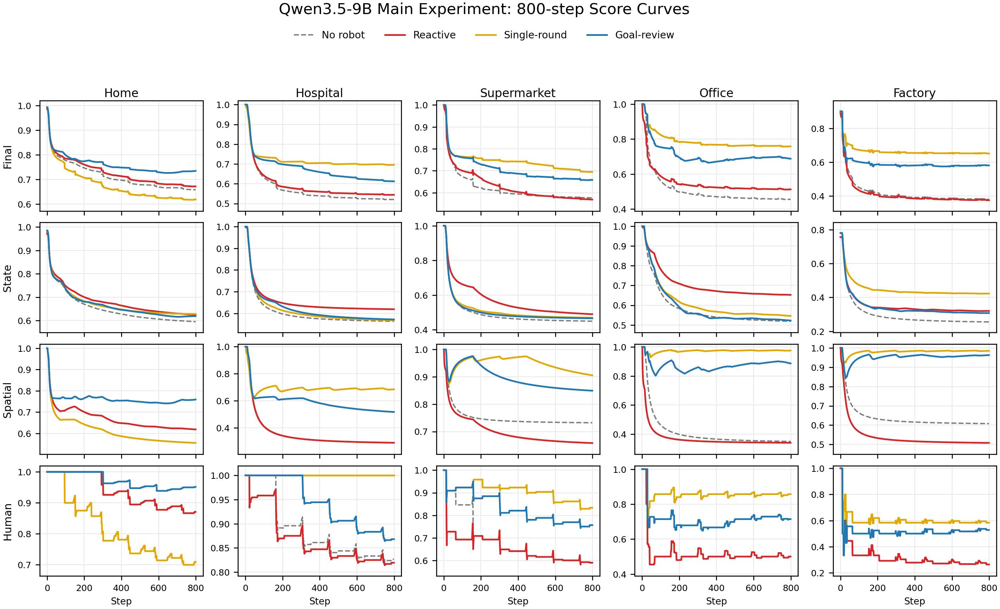

# GraphWorld

GraphWorld 是一个面向人机世界共生的动态图评测基准。它把具身智能评测从“一次性完成给定任务”推进到“在持续人类扰动下长期维护世界”：房间、物体、设备、NPC 和机器人都在同一张场景图里，状态会随人类日程、机器人动作、设备周期和环境规则不断变化。

## 我们关注的问题

服务机器人最终要进入的是一个被人持续使用的世界，而不是一个静态任务快照。人在家里穿衣、吃饭、洗漱；在医院看诊、用药、换床单；在超市购物、补货、结账；在办公室开会、归档、接待访客；在工厂上岗、生产、质检、交接。这些活动会不断消耗资源、弄脏物体、移动关键物品、打开设备、制造垃圾。

因此我们关心的问题是：

```text
机器人能不能在无限任务流中长期维持世界，而不是只完成一条给定指令。
```

这个问题的意义在于：长期共处能力不只取决于单步动作是否正确，也取决于机器人能否判断当前世界中哪些偏离会影响后续人类活动、是否能坚持完成多步闭环、是否能在新事件不断出现时避免被局部小问题吸走。

## 现有评测缺口

现有具身智能评测通常覆盖以下能力：

- 指令跟随：给定一个目标，看 agent 是否完成。
- 操作规划：在静态或短时程环境中生成动作序列。
- 导航与交互：测试局部观察、移动、抓取、开关和放置。
- LLM agent 决策：在合法动作候选中选择下一步动作。

这些评测很重要，但它们通常没有把“人类持续使用世界”作为核心扰动源，也很少同时追踪三类长期后果：

- `state`：世界状态是否健康，例如脏污、开闭、湿度、腐烂、设备状态。
- `spatial`：关键物体是否回到能支持后续活动的位置。
- `human`：人类事件是否因为前置条件被破坏而失败。

GraphWorld 的目标不是替代短任务成功率，而是补上长期世界维护这一层：机器人需要在持续扰动中调节状态健康、空间秩序和人类活动支持能力。

## Benchmark 设计

GraphWorld 把一个可持续运行的生活/工作环境建模为动态图：

```text
GraphWorld_t = SceneGraph + DynamicStates_t + HumanEvents_t + RobotActions_t
```

每个环境由五类核心机制组成：

| 模块 | 作用 |
| ---- | ---- |
| 场景图 | 表示房间、固定物体、可移动物体、设备、NPC 和机器人 |
| NPC 日程 | 按时间触发人类活动，活动成功或失败都会改变世界 |
| 动作系统 | 枚举并执行合法机器人动作，避免模型直接输出非法操作 |
| 环境过程 | 推进设备周期、晾干、腐烂、垃圾容量、补给刷新等变化 |
| 评分器 | 用 `state/spatial/human` 三维累计分衡量长期维护效果 |

评测不是要求机器人一次性完成固定目标，而是在 800 step 长期运行中不断制造新问题，让 agent 自主选择要维护什么、何时切换任务、如何完成闭环。

## 方法与模块

GraphWorld 的机器人 agent 不是纯反应式，也不是完整符号规划器，而是把规则约束、技能库和 LLM 语义选择结合起来：

```text
规则枚举问题和合法动作
+ active_goal 维持长期任务
+ skill_library 提供常见闭环流程
+ LLM 做语义选择
+ engine 执行动作并更新世界
```

主要代码入口：

| 文件 | 内容 |
| ---- | ---- |
| `backend/run_experiment.py` | 实验入口、resume、日志、metrics、TensorBoard |
| `backend/runtime/engine/runtime.py` | 每一步调度 human、robot、environment |
| `backend/core/assets/npc_library.py` | NPC 角色、日程、事件前提和事件效果 |
| `backend/core/assets/task_library.py` | 机器人技能库和长期闭环定义 |
| `backend/runtime/engine/validator.py` | 动作合法性检查 |
| `backend/runtime/engine/transition_rules.py` | 机器人动作造成的状态转移 |
| `paper/analysis/*.py` | 论文图表和诊断指标重算脚本 |

## 快速上手

当前论文实验统一使用 800 step，除非特别标注为 500 step 诊断子集。下面命令按本机工作区写法给出；如果环境路径不同，只需要替换 `PY`。

```bash
cd /home/swzz/data/GraphWorld
PY=/home/swzz/anaconda3/gra/bin/python
```

可用 agent mode：

```text
reactive
single_round
goal_review
```

跑 no-robot baseline：

```bash
$PY backend/run_experiment.py \
  --scene simple_supermarket_1f \
  --steps 800 \
  --only no_robot \
  --robots 0 \
  --humans 3 \
  --no-clean \
  --replay-scene-interval 20 \
  --metric-log-interval 10
```

跑一个 Qwen goal-review agent：

```bash
VLLM_MODEL=qwen3.5-9b \
VLLM_BASE_URL=http://127.0.0.1:8000/v1 \
$PY backend/run_experiment.py \
  --scene simple_supermarket_1f \
  --steps 800 \
  --only with_robot \
  --robots 1 \
  --humans 3 \
  --agent-model vllm-qwen3.5-9b \
  --agent-mode goal_review \
  --schedule-mode fixed \
  --schedule-seed 0 \
  --no-clean \
  --replay-scene-interval 20 \
  --metric-log-interval 10
```

重生论文图表和 PDF：

```bash
MPLCONFIGDIR=/tmp/matplotlib-cache $PY paper/analysis/plot_main_800_curves.py
MPLCONFIGDIR=/tmp/matplotlib-cache $PY paper/analysis/plot_model_comparison.py
MPLCONFIGDIR=/tmp/matplotlib-cache $PY paper/analysis/plot_profile_diversity_800.py
MPLCONFIGDIR=/tmp/matplotlib-cache $PY paper/analysis/plot_goal_review_schedule_grid.py
MPLCONFIGDIR=/tmp/matplotlib-cache $PY paper/analysis/plot_action_profile_800.py

cd paper
latexmk -xelatex -interaction=nonstopmode -halt-on-error main.tex
```

续跑和监控：

```bash
# 列出可续跑 run
$PY backend/run_experiment.py --resume

# 选一个 run_id 或完整 run 目录继续
$PY backend/run_experiment.py \
  --resume \
  --resume-run 20260620T142820Z_3d510941 \
  --no-clean

tensorboard --logdir backend/data/tensorboard --host 0.0.0.0 --port 6006
```

## 实验覆盖状态

论文使用的实验口径如下，详细数值见后文“实验”部分和 `paper/main.tex`。

### 覆盖矩阵

```text
Qwen fixed main:
5 base scenes x (no_robot + reactive + single_round + goal_review) x 800 steps = 20 runs

Qwen profile diversity:
5 base scenes x 3 profiles x goal_review x 800 steps = 15 with-robot runs
5 base scenes x 3 profiles x no_robot x 800 steps = 15 baseline curves

Qwen schedule diversity:
5 base scenes x 3 schedules x goal_review x 800 steps = 15 runs

Model backbone comparison:
Qwen3.5-9B + DeepSeek-R1-14B + Llama-3.1-8B
3 backbones x 5 base scenes x 3 robot methods x 800 steps = 45 with-robot runs

Human blocking recovery diagnostic:
5 base scenes x 3 robot methods x 500 steps = 15 diagnostic runs
```

主实验的 5 条 no-robot fixed baseline 已经重跑到 800 step。profile 条件下的 no-robot baseline 也已补齐；normal profile 复用 base fixed，compact/spread 为新增 raw runs。主曲线、模型对比图和 profile diversity 图均来自 raw metrics。

### 覆盖审计

没有必需的实验矩阵缺口。论文使用的 800-step 主图、profile 图、schedule 图和模型对比图均已由完整 raw metrics 重生。

## 引擎设计

GraphWorld 的世界状态是一个随时间演化的场景图：

```text
GraphWorld_t = Nodes + Edges + States_t + WorldState_t
```

`Nodes` 表示世界中的实体：

- `room`：房间或区域，例如 kitchen、pharmacy、checkout_area。
- `fixed_object`：固定家具、容器、设备，例如 bed、washer、fridge、cabinet、checkout counter。
- `movable_object`：可移动物体，例如 clothes、cup、medicine_box、shopping cart、toolkit。
- `agent`：人类 NPC 和机器人。

每个节点统一保留这些核心字段：

```text
id, node_type, semantic_type, states, parent, interactive_actions
```

其中：

- `id` 是唯一节点名，运行时动作必须使用真实 node id。
- `semantic_type` 表示物体类别，例如 cup、cabinet、medicine_box。
- `states` 是动态状态，例如 `is_dirty`、`is_open`、`fill_level`、`is_wet`。
- `parent` 表示当前位置或容器挂载关系。
- `interactive_actions` 决定该节点能参与哪些动作。

`Edges` 分三类：

- 结构关系：房间包含、房间连通、物体初始包含。
- 控制关系：button/knob 和设备之间的 controls。
- 动态关系：`in`、`on`、`at`、`near`、`held_by`、`worn_by`。

运行时不会把所有动态边写死，而是维护：

```text
parent_of, relation_of, room_of, children_of
```

这样空间拓扑和临时位置变化可以分开处理。比如 cup 从 table 被拿到 robot 手上，只需要更新 parent/relation，不需要重写整个场景结构。

### 状态系统

当前状态空间包括：

```text
is_dirty, is_clean, is_open, is_on, is_pressed,
is_wet, is_dry, folded, scattered, misplaced_near,
fill_level, is_full, cycle_remaining, dry_remaining,
is_rotten, is_burnt, freshness, temperature,
needs_cleaning, needs_return, needs_filing, needs_inspection,
vitality, is_wilted, current_activity
```

状态可以由四类机制改变：

1. 机器人动作：例如 `brush` 清理脏桌子，`open/close` 改变容器状态，`dump` 倒垃圾。
2. NPC 事件：例如吃饭弄脏餐具，顾客拿走商品，护士换下脏床单。
3. 设备周期：例如洗衣机运行后让衣物从 dirty 变成 clean/wet。
4. 环境时间：例如晾衣架让湿衣服随时间变干，食物随时间腐烂。

### 运行时系统

主运行时在 `backend/runtime/engine/runtime.py`。每一步顺序是：

```text
1. 根据 step/time 生成 human events
2. 机器人感知局部世界，得到 observation
3. 枚举合法 robot action candidates
4. agent 选择动作
5. RobotActionSystem 执行动作
6. HumanEventSystem 执行 NPC 事件
7. EnvironmentSystem 推进设备、干燥、腐烂、刷新等过程
8. 计算 metrics，写 replay 和 TensorBoard
```

几个关键模块：

- `runtime.py`：调度 robot、human、environment 三套系统。
- `validator.py`：判断动作是否合法，例如关闭容器不能取放，容量满不能继续放。
- `transition_rules.py`：定义动作造成的状态转移。
- `npc_library.py`：定义 NPC、日程、事件前提和事件效果。
- `task_library.py`：定义机器人可复用技能闭环。
- `run_experiment.py`：组织实验、记录 replay、metrics、TensorBoard。

### 动作空间

当前机器人动作：

```text
move, pick, place, press, open, close, brush, fold, dump
```

动作不是任意执行的。每一步先由引擎枚举合法候选，再交给 agent 选择。这样模型不会直接输出非法动作，而是在受限动作空间里做语义决策。

重要约束：

- `pick/place` 受容器开关、容量、可达性限制。
- openable 容器关闭时，不能直接取放内部物体。
- 布类物体不能靠 `brush` 洗干净，必须走 washer -> drying_rack -> fold -> wardrobe。
- 有液体的 cup 要到 sink 执行 `dump`。
- trash_bin 只能装合适垃圾，满了要到 garbage_station 执行 `dump`。
- 冷柜、药冰箱、柜子等如果没关，会影响后续人类事件。

### NPC 事件系统

人类活动由 `EventSpec` 表示：

```text
EventSpec = preconditions + effects_on_success + effects_on_failure
```

NPC 不是随机扰动源，而是由角色、日程和价值驱动事件组成：

```text
NPC = role + schedule
schedule = 按时间排列的 EventSpec
EventSpec = preconditions + effects + value_drivers + activity_pattern
```

`role` 决定 NPC 是 resident、patient、doctor、customer、cashier、office_worker 还是 factory_worker。`schedule` 决定一天中什么时候做什么。`value_drivers` 解释这个活动为什么存在，而 `effects` 解释这个活动如何改变世界。

当前使用五类 value drivers：

| value driver             | 含义             | 例子                                     |
| ------------------------ | ---------------- | ---------------------------------------- |
| `bodily_need`          | 基础生活需求     | 吃饭、睡觉、洗漱、穿衣、购物取生活物资   |
| `health_safety`        | 健康与安全       | 看病、用药、输液、安全装备、质检、维修   |
| `role_duty`            | 职业/角色职责    | 医生看诊、护士巡房、收银员结账、工人生产 |
| `social_coordination`  | 协作与交接       | 开会、交接班、访客帮助                   |
| `creative_improvement` | 创造、学习、改进 | 写报告、审阅、整理知识、改进流程         |

因此，人类事件不是为了给机器人硬造任务，而是先定义人的活动逻辑：人为了生活、健康、职责、协作和改进而行动；这些行动自然会消耗资源、移动物体、弄脏环境、打开设备、制造垃圾。机器人任务从这些副作用中产生。

例如一个事件可以表达：

- 顾客必须先有购物车，才能购物。
- 病人必须拿到药，才能离院。
- 工人必须有安全装备，才能上岗。
- 质检员必须有待检成品和记录表，才能完成质检。

事件成功会改变图状态，例如移动物体、弄脏表面、打开设备、消耗资源。事件失败会进入 replay 和 human_event_score，表示机器人没有维护好人的活动条件。

### 评分器

评分由三部分组成：

```text
final_score = 0.45 * state_score
            + 0.35 * spatial_score
            + 0.20 * human_event_score
```

`state_score` 衡量状态健康程度，例如是否脏、是否开着、是否湿、垃圾桶是否满、设备是否异常。它比较当前状态矩阵和初始好状态矩阵：

```text
state_distance_t = #different_comparable_states(S_t, S_0)
                 / #comparable_states(S_t, S_0)

instant_state_score_t = 1 - state_distance_t

state_score_t = mean(instant_state_score_0 ... instant_state_score_t)
```

`spatial_score` 衡量物体关系是否合理，例如药是否在药房、报告是否归档、购物车是否回入口、衣服是否在衣柜。它比较可移动物体的当前 parent/relation 和初始好位置：

```text
relation_distance_t = #misplaced_movable_objects(R_t, R_0)
                    / #movable_objects_in_baseline

instant_spatial_score_t = 1 - relation_distance_t

spatial_score_t = mean(instant_spatial_score_0 ... instant_spatial_score_t)
```

`human_event_score` 衡量 NPC 日程事件是否成功，例如顾客能否购物、病人能否取药、工人能否上岗。它是截至当前时刻已经结束的人类事件成功率：

```text
human_event_score_t = #successful_finished_human_events(0..t)
                    / #finished_human_events(0..t)
```

这三个分数都是长时程累计指标。坏状态持续越久，历史债越重；机器人后面修好了，instant score 会回升，累计分也会慢慢回升。

## 场景配置

集中分析已有五个场景。

| 场景        | 房间 | 固定物体 | 可移动物体 | NPC | NPC 角色                                              | 技能库                                                                                                                                                                                                                                             |
| ----------- | ---: | -------: | ---------: | --: | ----------------------------------------------------- | -------------------------------------------------------------------------------------------------------------------------------------------------------------------------------------------------------------------------------------------------- |
| home        |    7 |       51 |         17 |   1 | resident                                              | 3 种：`laundry_clothes`, `dispose_food`, `empty_cup`                                                                                                                                                                                         |
| hospital    |   10 |       48 |         11 |   3 | patient, nurse, doctor                                | 9 种：`replenish_prescription_sheet`, `replenish_medicine_box`, `return_refrigerated_medicine`, `clean_medical_waste`, `collect_dirty_linen`, `restock_clean_sheet`, `return_wheelchair`, `clean_waiting_area`, `clean_exam_bed` |
| supermarket |    7 |       16 |         11 |   3 | customer, cashier, stocker                            | 5 种：`return_cart`, `restock_produce`, `restock_cold_food`, `close_cold_case`, `maintain_checkout_and_trash`                                                                                                                            |
| office      |    7 |       24 |          3 |   3 | office_worker, manager, visitor                       | 4 种：`file_report`, `reset_meeting_room`, `return_cups`, `reset_workstations`                                                                                                                                                             |
| factory     |    8 |       19 |         10 |   3 | factory_worker, quality_inspector, maintenance_worker | 6 种：`return_safety_equipment`, `restock_parts`, `clear_finished_goods`, `file_quality_record`, `return_toolkit`, `reset_handover_area`                                                                                               |

### Home

NPC 事件：

```text
sleeping -> waking_up -> getting_dressed -> washing_up_morning
-> breakfast -> leaving_home -> away_at_work -> returning_home
-> waiting_for_dinner -> eating -> washing_up_night
```

主要闭环：

- 衣物：干净衣服被穿走，夜间变成脏衣服；机器人要洗衣、晾干、折叠、收回衣柜。
- 餐具：吃饭制造脏杯子、脏盘子、脏碗；机器人要清洁并归位。
- 食物：食物被消费后产生垃圾/坏食物；机器人要放入垃圾桶并倒掉垃圾。
- 空间秩序：鞋、餐具、衣服、垃圾桶等被移动后，需要回到合理位置。

### Hospital

NPC 事件：

```text
patient: hospital_away, patient_register, patient_wait, patient_consult,
         patient_take_medicine, patient_infusion, patient_leave

nurse: hospital_off_shift, nurse_prepare, nurse_round,
       nurse_deliver_medicine, nurse_change_bed_sheet,
       nurse_clean_bed, nurse_restock_supplies

doctor: hospital_off_shift, doctor_prepare, doctor_call_patient,
        doctor_examine_patient, doctor_prescribe
```

主要闭环：

- 处方单：医生开处方后，处方单需要回到诊室。
- 药品：药盒和冷藏药会被病人带走，离院后在补给区刷新，机器人要送回药房/药冰箱。
- 输液与治疗：治疗床、检查床、候诊区会变脏，需要清理。
- 床单：护士换床单后产生脏床单，需要回收；干净床单需要补回柜子。
- 医疗垃圾：医疗垃圾必须进入医疗垃圾桶，不能混进普通垃圾。
- 轮椅：病人使用后需要归位。

### Supermarket

NPC 事件：

```text
customer: store_away, customer_enter, customer_take_cart,
          customer_shop_produce, customer_shop_cold,
          customer_checkout, customer_leave_store

cashier: store_off_shift, cashier_prepare, cashier_scan_items
stocker: store_off_shift, stocker_inspect
```

主要闭环：

- 购物车：顾客拿车，结账后车到回收点；机器人要送回入口。
- 货架补货：水果、冷藏食品被顾客拿走，结账后进入到货区；机器人要补回货架/冷柜。
- 冷链：冷柜被打开后必须关上，否则后续冷藏购物事件失败。
- 收银区：收银台会变脏，显示屏需要保持可用，机器人要清理和维护。
- 垃圾：结账产生垃圾，垃圾桶满了要处理。

### Office

NPC 事件：

```text
office_worker: office_away, office_worker_arrive, office_focus_work,
               office_team_meeting, office_visitor_help, office_leave

manager: office_off_shift, office_manager_review, office_team_meeting
visitor: office_away, office_visitor_help
```

主要闭环：

- 报告：员工从文件柜拿报告，写完放桌上，会议后留在会议桌；机器人要归档回文件柜。
- 会议室：会议会弄脏桌子、打开显示器、留下杯子；机器人要清理并复位。
- 茶水间：访客和会议使用杯子，杯子需要清洁并回到茶水间。
- 办公桌：工作和管理审阅会弄脏桌面、打开电脑，机器人要清理和关停。

### Factory

NPC 事件：

```text
factory_worker: factory_off_shift, factory_worker_prepare,
                factory_load_parts, factory_run_assembly,
                factory_shift_handover

quality_inspector: factory_off_shift, factory_quality_check,
                   factory_shift_handover

maintenance_worker: factory_off_shift, factory_maintenance_check
```

主要闭环：

- 安全装备：工人上岗前要从入口柜取安全装备；机器人要回收到柜子。
- 物料：零件箱从仓库货架到产线；机器人要补回货架，保证下一轮生产。
- 成品：产线产生成品，质检后状态变化；机器人要清理工位和恢复空间。
- 质检记录：质检员使用记录表，机器人要归档回控制室柜子。
- 维修工具：维修员取工具维护机器，机器人要把工具包放回柜子。
- 交接：交接会打开控制室显示器、弄脏休息区桌面，需要机器人复位。

## 实验

当前实验目标是把 GraphWorld 当作长期机器人维护能力的诊断环境。我们不只看 agent 是否能输出合法动作，而是看它能不能在持续人类活动、环境时间和设备状态变化中长期恢复世界秩序。

### 实验设置

论文实验分为五组。

| 组别         | 含义                                                                                                                     |
| ------------ | ------------------------------------------------------------------------------------------------------------------------ |
| no_robot     | 只有 NPC 和环境推进，没有机器人维护                                                                                      |
| reactive     | 最弱 LLM 机器人：不给 active_goal、skills、initial_context、high_level_options，只给简单角色、最近分数、可见图和合法动作 |
| single_round | 一次 LLM 调用：给 active_goal、技能、候选动作，让模型直接选 high_level_task 和 action                                    |
| goal_review  | 两次 LLM 调用：先判断继续/切换/完成 active_goal，再选择低层 action                                                       |

| 实验组 | 矩阵 | 覆盖状态 |
| ------ | ---- | -------- |
| 主实验 | 5 base scenes x fixed schedule x `no_robot/reactive/single_round/goal_review` x 800 steps | Qwen3.5-9B 已完成，主图和表格使用 raw metrics |
| 模型主干对比 | Qwen3.5-9B、DeepSeek-R1-14B、Llama-3.1-8B x 5 scenes x 3 robot methods x 800 steps | 三个 backbone 均已进入正式图表 |
| Graph profile 多样性 | 5 scenes x `compact/normal/spread` x Qwen goal_review/no_robot x 800 steps | 已完成；图中实线为 goal-review，虚线为 no-robot baseline |
| 日程随机性 | 5 scenes x `fixed/calendar/stochastic` x Qwen goal_review x 800 steps | 已完成 |
| 人类阻塞恢复诊断 | 5 scenes x 3 robot methods x 500 steps | 已完成，只用于 blocking recovery，不和 800-step 主分数混合 |

### Graph profile

每个 base scene 有三种 profile，用来改变同一场景内部的拓扑和任务压力：

| profile | 目的 |
| ------- | ---- |
| `compact_cleaning` | 关键对象更集中，测试局部清洁和短链恢复 |
| `normal` | 复用 base scene，测试标准物流闭环 |
| `spread_device` | 关键房间和设备链拉远，测试长链任务和跨房间恢复 |

profile variant 的命名方式使用双下划线，例如：

```text
simple_home_1f__compact_cleaning
simple_home_1f__spread_device
```

落盘目录会被 slug 成单下划线形式，例如 `simple_home_1f_compact_cleaning`。

### 主图



这张图用于 base scene 方法对比。它按列展示五个场景，按行展示四个指标：

- `final_score`：综合长期表现。
- `state_score`：清洁、开闭、湿度、腐烂、设备状态等状态健康度。
- `spatial_score`：可移动物体是否回到合理位置。
- `human_event_score`：NPC 日程事件是否成功。

颜色含义：

- 灰色虚线：`no_robot`
- 红色：`reactive`
- 黄色：`single_round`
- 蓝色：`goal_review`

### Base scene 800-step 结果

下面是当前论文主表使用的 step 799 累计平均分。`F/S/Sp/H` 分别是 final、state、spatial、human event。

| 场景 | 方法 | F | S | Sp | H |
| ---- | ---- | -: | -: | -: | -: |
| home | no_robot | 0.659 | 0.596 | 0.619 | 0.871 |
| home | reactive | 0.672 | 0.625 | 0.619 | 0.871 |
| home | single_round | 0.619 | 0.629 | 0.555 | 0.710 |
| home | goal_review | 0.735 | 0.620 | 0.759 | 0.952 |
| hospital | no_robot | 0.521 | 0.563 | 0.290 | 0.826 |
| hospital | reactive | 0.544 | 0.619 | 0.290 | 0.819 |
| hospital | single_round | 0.695 | 0.568 | 0.685 | 1.000 |
| hospital | goal_review | 0.612 | 0.572 | 0.518 | 0.868 |
| supermarket | no_robot | 0.576 | 0.449 | 0.732 | 0.590 |
| supermarket | reactive | 0.568 | 0.489 | 0.658 | 0.590 |
| supermarket | single_round | 0.695 | 0.469 | 0.905 | 0.833 |
| supermarket | goal_review | 0.658 | 0.466 | 0.849 | 0.756 |
| office | no_robot | 0.456 | 0.519 | 0.350 | 0.500 |
| office | reactive | 0.513 | 0.652 | 0.340 | 0.500 |
| office | single_round | 0.758 | 0.546 | 0.975 | 0.857 |
| office | goal_review | 0.688 | 0.522 | 0.886 | 0.714 |
| factory | no_robot | 0.381 | 0.256 | 0.608 | 0.264 |
| factory | reactive | 0.375 | 0.320 | 0.508 | 0.264 |
| factory | single_round | 0.652 | 0.423 | 0.985 | 0.583 |
| factory | goal_review | 0.581 | 0.308 | 0.963 | 0.528 |

### 主要观察

1. `single_round` 在 hospital、supermarket、office 和 factory 取得最高 final score；`goal_review` 在 home 最高。
2. 结构化方法的主要收益来自 `spatial_score`，也就是把关键物体放回能支持下一轮人类事件的位置。
3. `reactive` 有时能维持 state score，但缺少跨房间归位和流程恢复能力，spatial score 通常拉不开。
4. `goal_review` 对模型能力更敏感。DeepSeek-R1-14B 在 goal-review 上明显高于 Qwen3.5-9B，说明“继续/切换目标”的判断依赖更强的上下文推理。
5. 人类阻塞恢复率显示，reactive 几乎不能恢复 blocking case；single_round 和 goal_review 能明显恢复流程前置条件，其中 goal_review pooled recovery 最高。

### 论文图表

| 图表 | 文件 |
| ---- | ---- |
| 主实验曲线 | `paper/figures/overview/score_curves_by_scene_metric.png` |
| 模型主干对比 | `paper/figures/model_comparison/model_final_score_comparison.png` |
| Graph profile 多样性 | `paper/figures/overview/diversity_profile_grid.png` |
| 日程随机性 | `paper/figures/overview/goal_review_schedule_avg_grid.png` |
| 动作画像 | `paper/figures/overview/action_profile_radar_by_method.png` |

论文主文件是 `paper/main.tex`，编译产物是 `paper/main.pdf`。

## 分数为什么涨落

分数下降不是单一原因，而是三条线共同作用：

```text
final_score = 0.45 * state_score
            + 0.35 * spatial_score
            + 0.20 * human_event_score
```

`state_score` 下降通常来自状态债：

- 桌面、床、候诊椅、检查床变脏。
- 冷柜、柜子、门、电脑、显示器被打开后没关。
- 垃圾桶 fill_level 上升。
- 衣服湿、脏、未折叠。
- 机器进入 needs_maintenance。

`spatial_score` 下降通常来自位置债：

- 人把物体从初始位置拿走，比如衣服、药盒、报告、工具、购物车。
- 物体进入中间节点，比如到货区、回收点、会议桌、产线、病人身上。
- 机器人拿起物体但没完成放回。

`human_event_score` 下降来自服务失败：

- 人需要的东西不在正确位置，例如干净衣服不在衣柜、药不在药房、购物车不在入口、报告不在桌上。
- 设备状态不对，例如冷柜没关、收银屏幕没开、治疗床没清理。
- 上一个闭环没完成，导致下一次人类活动无法继续。

分数回升一般来自机器人完成闭环：

- 清洁动作让 dirty/needs_cleaning 消失，state_score 回升。
- pick/place 把关键物体放回初始或任务需要的位置，spatial_score 回升。
- 倒垃圾、补货、归档、关冷柜、补药、回收床单这些动作，让下一轮 NPC 事件重新可成功，human_event_score 回升。

所以涨落不是噪声，而是“人制造任务 -> 世界变差 -> 机器人维护 -> 世界恢复”的周期。真正要深入分析的，是机器人在哪些时间点完成了哪些闭环，以及这些闭环之后哪一项分数回升。

## Agent 方法

当前主方法不是纯反应式，也不是完整符号规划器，而是：

```text
规则枚举问题和合法动作
+ active_goal 维持长期任务
+ skill_library 提供常见闭环流程
+ LLM 做语义选择
+ ranker/engine 做约束和纠偏
```

### 输入怎么组装

每一步给模型的主要字段：

```json
{
  "task": "Restore the scene toward the initial good arrangement...",
  "robot_state": {
    "step": 0,
    "room_or_parent": "living_room",
    "holding": "",
    "visible_rooms": ["living_room"]
  },
  "rules": [
    "Prefer actions that directly fix bad states...",
    "Use pick before place...",
    "Dirty clothes must be washed in washer..."
  ],
  "active_goal": {},
  "skills": [],
  "initial_context": {
    "visible_rooms": [],
    "target_rooms": [],
    "room_edges": [],
    "initial_locations_for_current_issues": [],
    "relevant_interaction_targets": [],
    "current_spatial_issues": []
  },
  "high_level_options": [],
  "visible_nodes": [],
  "candidates": [],
  "response_format": {
    "high_level_task": "skill_name or restore_initial_position object -> initial_parent",
    "action_index": 0
  }
}
```

字段含义：

- `robot_state`：机器人当前在哪里、拿着什么、看见哪些房间。
- `rules`：硬规则和常识约束，告诉模型什么捷径不允许。
- `active_goal`：当前长期目标，例如“把某件衣服洗净晾干叠好收回衣柜”。
- `skills`：只放当前相关技能，不把完整手册塞进去。
- `initial_context`：初始位置、房间连接、目标房间、当前空间错误和交互目标。
- `high_level_options`：模型只能从这里选大目标，不能随便编 goal。
- `visible_nodes`：当前可见节点和状态。
- `candidates`：引擎校验过的合法动作，每个动作有 `action_index`。

### Reactive baseline

Reactive baseline 是最弱机器人方法，只调用一次 LLM，但不给长期任务结构：

```text
输入：简单角色提示 + 最近分数 + robot_state + visible_nodes + candidates
输出：action_index
```

它不知道 initial good arrangement，不知道 active_goal，不看 skill，不看 high_level_options。这个 baseline 用来回答：如果只靠局部可见图和分数反馈，模型能不能自己长期维护世界。

### 单轮方法

单轮只调用一次 LLM：

```text
输入 active_goal + skills + candidates
输出 high_level_task + action_index
```

优点是便宜、直接。问题是模型每一步容易被局部候选吸走，比如看到 close/open/brush 就去做短动作，而不是坚持完成长流程。

### 多轮/goal-review 方法

多轮每步调用两次 LLM：

```text
1. goal review:
   在 active_goal 和 high_level_options 里选择 continue / switch / finish / drop

2. action choice:
   在当前 goal 下选择一个 legal action_index
```

这样做的动机是把“我要不要继续当前大目标”和“当前执行哪一步动作”拆开。它更接近人做事：先判断任务是否完成或卡住，再决定下一步。

当前限制也很清楚：如果每一步都问 goal review，模型可能过度切换目标。更合理的版本是只在这些情况下 review：

- active_goal 已经完成。
- 连续多步没有推进。
- 当前目标对象不可见或不可达。
- 出现高优先级短任务，例如垃圾桶满、冷柜开着、关键设备异常。

### 技能库

技能库在 `backend/core/assets/task_library.py`，现在包含家庭和医院的完整闭环：

```text
dispose_food
empty_cup
laundry_clothes
replenish_prescription_sheet
replenish_medicine_box
return_refrigerated_medicine
clean_medical_waste
collect_dirty_linen
restock_clean_sheet
return_wheelchair
clean_waiting_area
clean_exam_bed
```

技能不是替代 LLM 的固定脚本，而是告诉模型“这类任务应该帮人帮到底”。例如 laundry 不是 brush 一下衣服，而是：

```text
放进洗衣机 -> 启动洗涤 -> 放到晾衣架 -> 等干 -> fold -> 收进衣柜
```

## 运行机制

每一步：

1. 根据世界时间生成 NPC 事件。
2. 机器人局部观察，得到可见节点和合法候选动作。
3. 系统枚举可维护的问题，更新或保留 active_goal。
4. LLM 选择目标和动作。
5. `RobotActionSystem` 执行动作。
6. `HumanEventSystem` 执行人类活动，并记录成功/失败。
7. `EnvironmentSystem` 推进设备周期、晾干、腐烂、垃圾刷新等环境过程。
8. 写出 replay、metrics、TensorBoard。

动作空间：

```text
move, pick, place, press, open, close, brush, fold, dump
```

重要约束：

- 关闭的容器不能直接取放。
- 布类不能 brush 洗干净，必须走洗衣流程。
- wet cloth 要上 drying_rack，随时间变干。
- 垃圾桶有容量，满了要去 garbage_station dump。
- 冷柜、药冰箱等 openable 容器会影响后续人类事件。
- movable object 必须用真实 node id，不能用 semantic_type 当目标。

## 当前结论

1. GraphWorld 能区分“局部合法动作选择”和“长期世界维护”。`reactive` 有时能维持局部 state score，但缺少跨房间归位和流程恢复能力。
2. 结构化 agent 的主要收益来自 `spatial_score`：把关键物体放回能支持下一轮人类活动的位置，是长期共生的核心能力之一。
3. `single_round` 在多个 base scene 中取得最高 final score，说明一次性高层任务选择已经能触发有效搬运和归位闭环。
4. `goal_review` 对模型主干更敏感。DeepSeek-R1-14B 在 goal-review 上最高，Llama-3.1-8B 次之，Qwen3.5-9B 相对更低，说明目标复审需要更强的上下文判断。
5. 人类阻塞恢复率提供了比总分更直接的流程级诊断：reactive 几乎不能恢复 blocking case，而 single_round 和 goal_review 能明显恢复人类活动前置条件。
6. 当前仍未解决的是稳定全局调度：agent 会被局部可见问题吸引，会中途切换长链任务，也会错过人类事件的恢复窗口。
