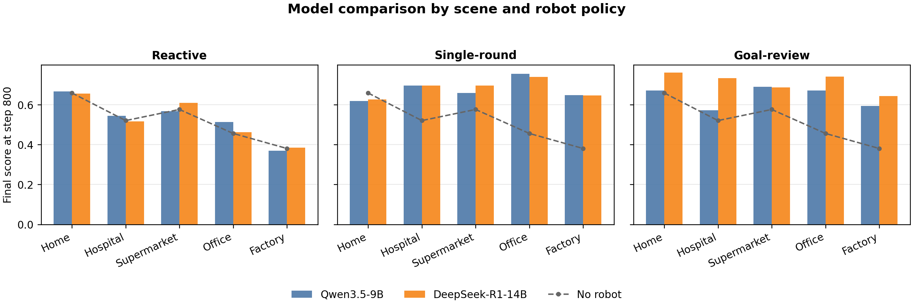
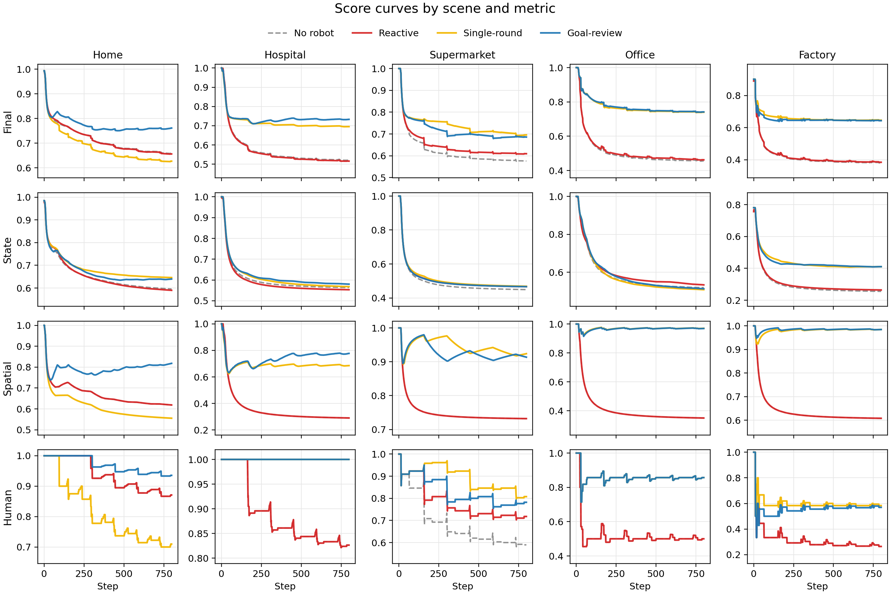
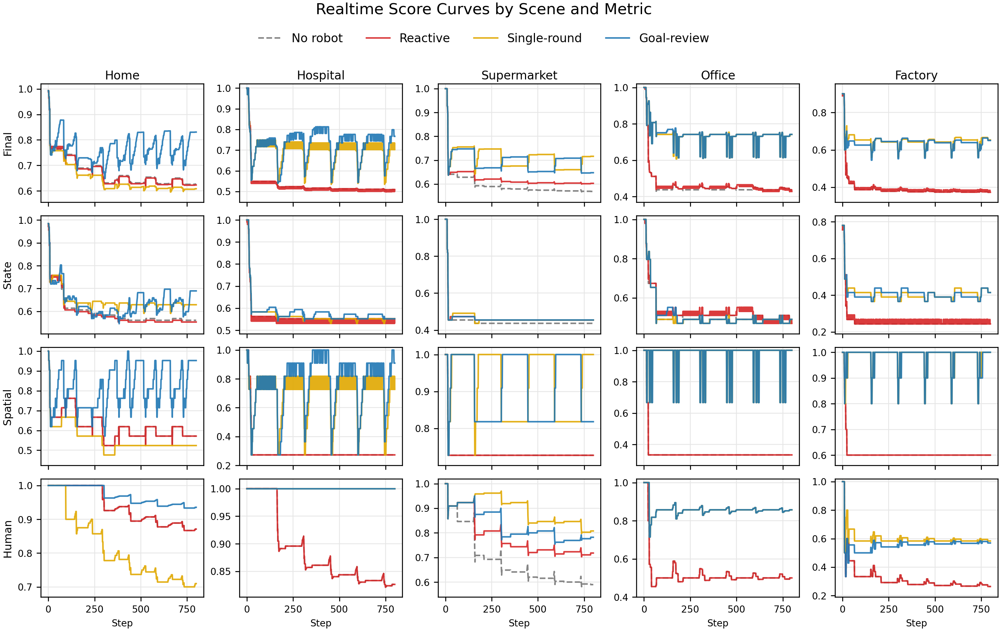

# GraphWorld progress update - 2026-05-30

## One-line status

We now have a complete 800-step main experiment over 5 scenes, 3 robot policies, and 2 local LLM backbones. The current results show that graph-based long-horizon maintenance is measurable, robot policies can recover world score above the no-robot baseline, and the stronger model especially improves the goal-review policy.

## What is finished

- Completed main 800-step runs on 5 scenes: home, hospital, supermarket, office, factory.
- Completed 4 conditions per scene: no robot, reactive robot, single-round LLM robot, goal-review LLM robot.
- Completed model comparison for two LLM backbones:
  - Qwen3.5-9B
  - DeepSeek-R1-14B
- Added robust JSON parsing and vLLM DeepSeek configuration for the experiment runner.
- Generated updated figures for Qwen, DeepSeek, and cross-model comparison.

## Current headline result

Average final score over 5 scenes at step 800:

| Policy | Qwen3.5-9B | DeepSeek-R1-14B |
| --- | ---: | ---: |
| Reactive | 0.5323 | 0.5257 |
| Single-round | 0.6748 | 0.6808 |
| Goal-review | 0.6397 | 0.7130 |

Average improvement over no-robot baseline:

| Policy | Qwen3.5-9B | DeepSeek-R1-14B |
| --- | ---: | ---: |
| Reactive | +0.0139 | +0.0073 |
| Single-round | +0.1564 | +0.1624 |
| Goal-review | +0.1213 | +0.1946 |

Interpretation:

- Reactive control is usually too local and does not reliably repair long-horizon degradation.
- Single-round planning already improves the world score substantially in most scenes.
- Goal-review benefits more from the stronger model: DeepSeek-R1-14B gives the best average score and the largest gain over no-robot baseline.
- Scene-level differences remain important: some policies are strong in structured scenes such as office/factory, while home remains sensitive to incomplete long task chains.

## Figures to show

Main cross-model comparison:

Qwen main curves:

DeepSeek main curves:

DeepSeek real-time score curves:

## Useful files

- Cross-model figure: `paper/figures/model_comparison/model_final_score_comparison.png`
- Cross-model summary table: `paper/figures/model_comparison/model_final_scores_summary.csv`
- DeepSeek figures: `paper/figures/deepseek/overview/`
- Qwen figures: `paper/figures/overview/`
- Figure script for model comparison: `paper/analysis/plot_model_comparison.py`

## Short message for advisor

> I have finished the 800-step main experiment on five GraphWorld scenes. The current comparison includes no-robot baseline, reactive robot, single-round LLM policy, and goal-review LLM policy, using both Qwen3.5-9B and DeepSeek-R1-14B. The main finding is that robot policies can recover the long-term world score above the no-robot baseline, and the goal-review policy benefits most from the stronger DeepSeek model. Average improvement over no-robot is about +0.162 for single-round DeepSeek and +0.195 for goal-review DeepSeek. I also generated the cross-model comparison figure and per-scene score curves.

## Next steps

- Move the current figures into the paper result section.
- Write the experiment setup paragraph: scenes, policies, metrics, 800-step horizon, local vLLM models.
- Add one qualitative failure/success case to explain why goal-review helps.
- Decide whether to rerun the final paper version at 1600 steps or keep 800-step results as the current main result.
